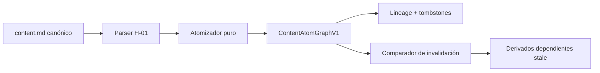

# Content Atom Graph V1

Este contrato convierte un `CanonicalContentDocumentV1` congelado en unidades pequeñas con
identidad estable, linaje explícito e invalidación mínima. Es una proyección determinista: no añade
claims, herramientas disponibles, duraciones ni autorización de publicación. [DOC]

## Identidad y revisión

`atomId` es un surrogate opaco y persistente. El matching se limita al parent graph declarado y es
exacto. Campos singulares usan su nombre canónico; soportes, claims, relaciones y capabilities usan
el ID authored. Un beat usa `purpose`, claims ordenados canónicamente, capabilities ordenadas y
`stateDisclosure`; `label` solo desambigua cuando la clave primaria devuelve varios candidatos.

- Match único: conserva ID; copy nuevo incrementa revisión.
- Sin match: crea identidad con la siguiente generación válida.
- Varios matches: `ATOM_IDENTITY_AMBIGUOUS`.
- Eliminación: tombstone; una reintroducción nunca resucita el ID retirado.
- Cambio de propósito o bindings: elimina la identidad anterior y crea otra.

La posición pertenece a la topología. Reorder conserva identidades y revisiones de payload, pero
cambia el grafo y las aprobaciones ligadas a él. [CONFIG]

## Dominios de hash

| Hash                  | Cubre                                           | Excluye                         |
| --------------------- | ----------------------------------------------- | ------------------------------- |
| `payloadSha256`       | ID, clase, tipo y contenido semántico           | actores y run                   |
| `revisionSha256`      | payload, origen, evidencia, derechos y contexto | dependencias downstream         |
| `inputSha256`         | dependencias efectivas por política de edge     | reloj, red y posición implícita |
| `outputSha256`        | revisión, inputs, atomizador y rights efectivos | datos no dependientes           |
| `semanticGraphSha256` | outputs y topología semántica                   | Markdown raw y actores          |
| `graphSha256`         | versión, revisiones, edges y registro completo  | receipt auto-hash               |

Los edges `hard` propagan output y derechos. Los edges `topology_only` incluyen ID de origen y
ordinal, pero no copy, evidencia, autoridad ni rights upstream. Esta separación mantiene estable la
secuencia cuando cambia una frase y evita convertir orden editorial en permiso. [CONFIG]

## Fixture de referencia

`pilot-carousel-002@0.1.0` materializa 39 átomos y 50 aristas: 23 narrativos, 11 visuales, uno
temporal y cuatro de entrega; 37 aristas hard y 13 topológicas. Estas cifras son criterio del fixture,
no límites globales del schema. [CÓDIGO]

La simulación `0.1.1` sustituye únicamente “la velocidad no reemplaza la dirección” por “la
velocidad necesita dirección”. Debe conservar el `atomId` del beat, cambiar solo su revisión/output,
mantener 38 outputs y la secuencia, cambiar hashes globales y volver stale cualquier aprobación del
grafo anterior. La simulación nunca sustituye `content.md` ni el receipt H-01. [CONFIG]

## Límites de H-02

H-02 acredita `evidenceState=QUALIFIED` y `structuralState=ATOMIZED`. El claim calificado conserva
`qualified_internal_derivation`; las cinco capabilities siguen `planned_only`. VoiceProfile candidato,
corpus 0/4, claims fuera del registro central, dependencias H-03, dataset medido y DAG/A11 siguen
como `coverage_gap`. Distribución permanece `NOT_DESIGNED` y publicación, prohibida. [DOC]
