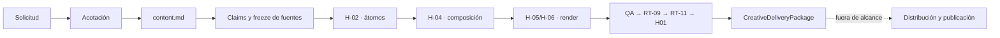

# Red de Creación Instagram V3

Estado del hito: `H-01_IMPLEMENTED_CANDIDATE`. Estado máximo acreditable: `SCOPED`. [CONFIG]

Este documento evoluciona la V2 sin reemplazarla. Define la red de creación hasta
`CREATION_READY`, conserva el carrusel V1 como historia y mantiene distribución, publicación y
automatización fuera de esta macrofase. [METODOLOGIA]

## 1. Decisión y frontera

- Los agentes administran contexto, decisiones, excepciones y evaluación. [CONFIG]
- Los workflows ejecutan rutas deterministas, repetibles y observables. [CONFIG]
- Las skills encapsulan capacidades reutilizables; los renderers producen derivados sin añadir
  claims, cifras, CTA o conclusiones. [CONFIG]
- La creación termina en un paquete verificable. `distributionState: NOT_DESIGNED` y
  `publicationAuthority: false` son invariantes de esta fase. [CONFIG]
- H-01 no instala dependencias, no renderiza, no atomiza y no activa otro workflow. [CONFIG]

## 2. Modelo operativo

La topología conserva dos agentes permanentes y especialistas efímeros. RT-01 abre y cierra el run;
RT-11 revisa después de RT-09 y nunca remedia el candidato evaluado. Los especialistas operan con
concurrencia máxima dos. El comité usa cinco roles y veinte revisiones cruzadas. [CONFIG]

| Capa     | Autoridad                     | Produce                       | No puede hacer                            |
| -------- | ----------------------------- | ----------------------------- | ----------------------------------------- |
| Agente   | contexto, excepción, decisión | envelope, síntesis, veredicto | inventar evidencia o publicar             |
| Workflow | ruta y gates                  | derivados reproducibles       | cambiar el objetivo por iniciativa propia |
| Skill    | capacidad acotada             | procedimiento y validación    | ampliar permisos                          |
| Renderer | spec aprobada                 | asset derivado                | introducir contenido                      |

## 3. Contrato Markdown-first

`content.md` es la única fuente editorial authored. Su frontmatter contiene identidad, routing,
bindings y políticas; el cuerpo contiene audiencia, problema, promesa, tesis, soportes, claims,
recorrido, intención visual, acción, derechos, accesibilidad y límites. [CONFIG]

El parser H-01:

1. conserva un hash de los bytes exactos;
2. rechaza claves desconocidas, duplicadas, anchors, aliases, tags y merges YAML;
3. normaliza un AST editorial cerrado;
4. calcula un hash semántico independiente;
5. verifica cada referencia contra una allowlist portable;
6. limita el resultado authored a `DRAFT` y el run acreditado a `SCOPED`. [CÓDIGO]

Cambiar una frase, un binding o el orden editorial cambia el hash semántico. Cambiar EOL, trailing
whitespace no semántico u orden de claves YAML solo cambia el hash raw. [CONFIG]

## 4. Evidencia y source freeze

`SourceFreezeManifestV1` enumera cada archivo leído con ruta relativa y SHA-256;
`SourceFreezeReceiptV1` liga ese read set al hash raw y semántico del contenido. Un digest agregado
sin entradas verificables no constituye evidencia suficiente. El repositorio externo sucio no se
promueve: H-01 usa únicamente proyecciones y perfiles portables ya hash-bound. [CONFIG]

Cada claim declara tipo, soporte, autoridad, rol de evidencia, locator y límite. Los claims de
sistema describen este OS, no una verdad universal. Una fuente `candidate` solo admite soporte
calificado. Un resultado de desempeño exige dataset, unidad, periodo, denominador y método.
[CONFIG]

Gaps que permanecen abiertos:

- `voice_owner_confirmation_pending`;
- `canonical_corpus_0_of_4`;
- `planned_motion_capabilities_not_installed_or_validated`;
- `technical_sources_not_yet_promoted`;
- `no_measured_performance_dataset`;
- `publication_not_authorized`. [DOC]

## 5. Semántica visual authored

`AuthoredVisualDirectionV1` expresa la relación que debe comprenderse, las referencias que la
respaldan, lo que debe preservarse, lo que no debe insinuarse y su equivalencia textual. No contiene
layout, coordenadas, geometría, color, tipografía, frames, renderer ni formato de archivo. [CONFIG]

Las relaciones solo pueden apuntar a tesis, problema, promesa, CTA, soportes, claims o capacidades
planificadas. Una cifra visual requiere un claim cuantitativo completo; un indicador sugerido no
puede dibujarse con magnitudes inventadas. [CONFIG]

## 6. Cinco capacidades planificadas

H-01 conserva D3, Three.js, Lottie, GSAP y el compositor creativo Remotion V3 porque el Carousel V2
aprobado debe demostrar las cinco. En este hito son `planned_capability`: no implican instalación,
licencia resuelta, disponibilidad, validación ni readiness. [CONFIG]

| Capacidad   | Resultado editorial requerido                              | Gate técnico |
| ----------- | ---------------------------------------------------------- | ------------ |
| D3          | relaciones, matrices y diagramas con semántica verificable | H-03         |
| Three.js    | una vista 3D con función explicativa y fallback posterior  | H-03         |
| Lottie      | micro-motion local y poster determinista                   | H-03         |
| GSAP        | coordinación temporal controlada por frame                 | H-03         |
| Remotion V3 | reloj, stills y preview del compositor genérico            | H-03         |

Las capacidades no pueden respaldar claims ni activar render. La capacidad histórica de VS-001 no
prueba la disponibilidad del compositor creativo V3. [CONFIG]

## 7. Referencia editorial de Carousel V2

Tema: **Método antes que herramientas**. La secuencia requerida se conserva como intención authored,
no como spec renderizable: [DOC]

1. tesis;
2. decisión workflow o agente;
3. agentes administran y workflows ejecutan;
4. matriz de ocho workflows;
5. Markdown → átomos → composición → render → QA → Guardian;
6. router D3, Three.js, Lottie, GSAP y Remotion según intención;
7. paquete creativo terminado y distribución como frontera futura;
8. una acción: diseñar primero el sistema que producirá el contenido.

Los nombres de capacidades de la tarjeta 6 deben mostrar estado planificado hasta que H-03 cierre
dependencias, licencias, adapters, fixtures y determinismo. [CONFIG]

## 8. Compatibilidad

- `pilot-carousel-001` y VS-001 permanecen byte-idénticos. [CONFIG]
- El adapter V1 es puro, unidireccional y read-only. Proyecta omisiones como `coverage_gap`; nunca
  migra ni reescribe historia. [CONFIG]
- `visual_cue` V1 se conserva como nota legacy y no se eleva a dirección visual V3. [CONFIG]
- `DistributionVariantV1` y los contratos V2 siguen exportados. [CONFIG]

## 9. H-01: aceptación y límites

H-01 pasa cuando existen contrato, parser, fixture canónico, freeze verificable, adapter legacy,
comité `5/20`, pruebas positivas y hostiles, y `verify:creation-doc` integrado en `pnpm verify`.
[CONFIG]

Fuera de H-01:

- átomos, linaje e invalidación: H-02;
- dependencias, licencias, skills y adapters ejecutables: H-03;
- visual core, tokens, módulos y PDF: H-04;
- Carousel V2 y render: H-05/H-06;
- otros siete workflows: gates H-07.x;
- distribución, publicación y automatización: fuera de MacroFase A. [CONFIG]

Siguiente gate: `APRUEBO HITO H-02`. Hasta recibirlo, el estado permanece `SCOPED`; no equivale a
`EVIDENCE_VALIDATED`, `ATOMIZED`, `COMPOSED`, `RENDERED_DRAFT`, `HUMAN_APPROVED` ni
`CREATION_READY`. [CONFIG]
