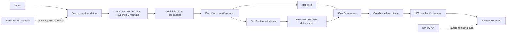

# Arquitectura del OS agéntico creativo

## Propósito

El repositorio convierte expedientes gobernados en productos Web y Contenido/Motion sin delegar
la verdad, la decisión creativa o la publicación a un renderer o a un conector. [CONFIG]

## Capas y responsabilidades

| Capa                                                  | Responsabilidad                                                                     | No puede hacer                     |
| ----------------------------------------------------- | ----------------------------------------------------------------------------------- | ---------------------------------- |
| `inbox/`, `registries/sources/`, `registries/claims/` | Ingesta, dedupe, autoridad, derechos, snapshots y claims                            | Promover referencias sin evidencia |
| `core/`                                               | Contratos Zod, hashes canónicos, receipts, memoria append-only y máquinas de estado | Interpretar creativamente          |
| `agents/`, `committees/`                              | Propuestas, crítica cruzada, rúbrica, dissent y síntesis                            | Persistir chain-of-thought privado |
| `networks/web/`                                       | Modelo y render Web offline                                                         | Publicar o añadir claims           |
| `networks/content/`                                   | Copy, captions y timing derivado                                                    | Fijar una duración universal       |
| `renderers/remotion/`                                 | Composición frame-driven, stills y medios reproducibles                             | Aprobar, recordar o publicar       |
| `adapters/notebooklm/`                                | Grounding read-only con digest y cobertura                                          | Escribir notebooks o ocultar gaps  |
| `adapters/n8n/`                                       | Proponer transporte idempotente de evidencia hash-bound                             | Reinterpretar brief o saltar H01   |
| `quality/`, `governance/`, `guardian/`                | Verificación independiente, derechos, accesibilidad y decisión Guardian             | Corregir desde el rol Guardian     |

## Contrato NotebookLM por unidad

NotebookLM no es contexto implícito. Los once agentes y los workflows `core`, `web`, `content` y
`adapters` declaran un bloque estructurado con binding, propósito, pregunta, source IDs previstos y
cobertura. `scripts/check-notebooklm.ts` valida las quince declaraciones contra el registro de
bindings, el source registry y los entrypoints reales. [CÓDIGO][CONFIG]

Mientras `NB-BINDING-INSTAGRAM-CONTENT-001` permanezca en `mode: none`, toda unidad conserva
`coverage_gap`, cero fuentes cubiertas, cero evidence refs, mutación prohibida y efecto nulo sobre
`SOURCE_LOCKED`. Ninguna respuesta de NotebookLM puede registrarse como evidencia en ese estado.
[CONFIG][coverage_gap]

## Fuente de verdad material

El expediente bajo `projects/<project-id>/` conecta:

1. source bundle y claims ledger;
2. decisión del comité;
3. modelos de Web y Contenido;
4. dossier audiovisual 00–07;
5. props, assets y componentes fijados;
6. outputs y receipts con SHA-256;
7. QA, Guardian y approvals.

Una respuesta de una herramienta no reemplaza ese expediente. Un estado solo avanza con evidencia
permitida por la máquina y, cuando aplica, un aprobador distinto del productor. [CÓDIGO][CONFIG]

## Dos dimensiones de estado

- `governed_workflow_state`: avance canónico. Con corpus `0/4`, queda bloqueado antes de
  `SOURCE_LOCKED`.
- `technical_validation_state`: demuestra que una implementación sintética compila, renderiza y
  es reproducible localmente.
- `visible_status`: comunica al revisor qué está viendo; para VS-001 es `RENDERED_DRAFT`.

Esta separación permite probar el sistema sin fingir que las fuentes, derechos, Guardian o H01 ya
existen. `RENDER_VALIDATED` técnico nunca concede por sí solo `READY`. [CONFIG]

## Fronteras de confianza

- Los locators privados viven fuera de archivos versionables.
- El render no usa red, reloj de pared, timers ni assets remotos.
- Las referencias sin licencia quedan `candidate`, `quarantined` o `reference_only`.
- Los outputs externos requieren paquete, hashes, idempotency key, aprobación y rollback.
- CI valida código; el cierre local conserva además evidencia audiovisual y toolchain exacto.

## Decisiones canónicas

Las decisiones de arquitectura están en `docs/adrs/0001-0020-decisions.md`; el DAG y la propiedad
de escritura están en `docs/program/dag.yml` y `docs/program/ownership-manifest.yml`.
