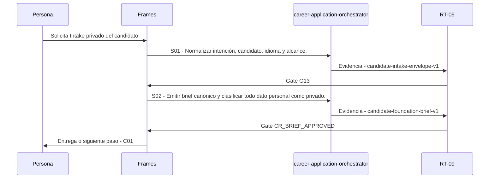

# C00 · Intake privado del candidato

> Esta página se genera desde el workflow canónico. Para cambiarla, edita [su fuente](../../../02_proceso/workflows/career/c00-intake/workflow.yml) y regenera la documentación.

## Qué puedes conseguir

Clasificar identidad, privacidad, alcance y preguntas bloqueantes antes de crear artefactos.

## Cuándo usarlo

Frames selecciona este recorrido cuando el resultado solicitado corresponde a **Intake privado del candidato**. Comando equivalente: `/career-intake`.

## Qué necesita

- `career-intent-v1`

## Qué entrega

- `candidate-intake-envelope-v1`
- `candidate-foundation-brief-v1`

## Cómo avanza

| Paso | Qué ocurre                                                          | Skill principal                   | Resultado                     | Aprobación          |
| ---- | ------------------------------------------------------------------- | --------------------------------- | ----------------------------- | ------------------- |
| S01  | Normalizar intención, candidato, idioma y alcance.                  | `career-application-orchestrator` | candidate-intake-envelope-v1  | `G13`               |
| S02  | Emitir brief canónico y clasificar todo dato personal como privado. | `career-application-orchestrator` | candidate-foundation-brief-v1 | `CR_BRIEF_APPROVED` |

## Diagrama de secuencia

### Alternativa textual

1. La persona solicita Intake privado del candidato.
2. S01: career-application-orchestrator produce candidate-intake-envelope-v1; RT-09 decide G13.
3. S02: career-application-orchestrator produce candidate-foundation-brief-v1; RT-09 decide CR_BRIEF_APPROVED.
4. Frames entrega el resultado y propone C01.

## Límites y detención

Datos reales permanecen en work/private; sin candidato resoluble, BLOCKED.

Gates: `G13`, `CR_BRIEF_APPROVED`. Solo una aprobación inequívoca permite avanzar.

## Siguiente paso

Si el resultado queda aprobado, Frames puede continuar con **C01**.
