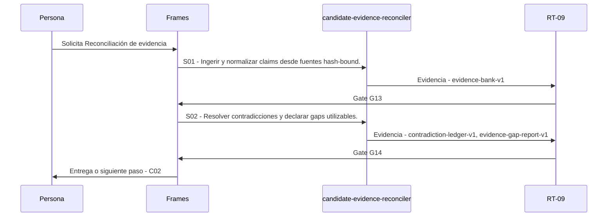

# C01 · Reconciliación de evidencia

> Esta página se genera desde el workflow canónico. Para cambiarla, edita [su fuente](../../../02_proceso/workflows/career/c01-evidence/workflow.yml) y regenera la documentación.

## Qué puedes conseguir

Convertir fuentes autorizadas en claims trazables sin pulir gaps o contradicciones.

## Cuándo usarlo

Frames selecciona este recorrido cuando el resultado solicitado corresponde a **Reconciliación de evidencia**. Comando equivalente: `/career-evidence`.

## Qué necesita

- `candidate-foundation-brief-v1`
- `candidate-sources`

## Qué entrega

- `evidence-bank-v1`
- `contradiction-ledger-v1`
- `evidence-gap-report-v1`

## Cómo avanza

| Paso | Qué ocurre                                            | Skill principal                 | Resultado                                       | Aprobación |
| ---- | ----------------------------------------------------- | ------------------------------- | ----------------------------------------------- | ---------- |
| S01  | Ingerir y normalizar claims desde fuentes hash-bound. | `candidate-evidence-reconciler` | evidence-bank-v1                                | `G13`      |
| S02  | Resolver contradicciones y declarar gaps utilizables. | `candidate-evidence-reconciler` | contradiction-ledger-v1, evidence-gap-report-v1 | `G14`      |

## Diagrama de secuencia

### Alternativa textual

1. La persona solicita Reconciliación de evidencia.
2. S01: candidate-evidence-reconciler produce evidence-bank-v1; RT-09 decide G13.
3. S02: candidate-evidence-reconciler produce contradiction-ledger-v1, evidence-gap-report-v1; RT-09 decide G14.
4. Frames entrega el resultado y propone C02.

## Límites y detención

No convertir inferred o missing en capacidad demostrada.

Gates: `G13`, `G14`. Solo una aprobación inequívoca permite avanzar.

## Siguiente paso

Si el resultado queda aprobado, Frames puede continuar con **C02**.
