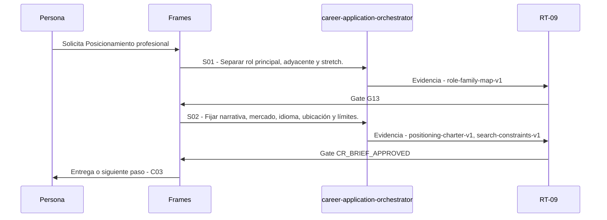

# C02 · Posicionamiento profesional

> Esta página se genera desde el workflow canónico. Para cambiarla, edita [su fuente](../../../02_proceso/workflows/career/c02-positioning/workflow.yml) y regenera la documentación.

## Qué puedes conseguir

Definir familias de rol y restricciones a partir de evidencia, no de aspiraciones tratadas como hechos.

## Cuándo usarlo

Frames selecciona este recorrido cuando el resultado solicitado corresponde a **Posicionamiento profesional**. Comando equivalente: `/career-positioning`.

## Qué necesita

- `candidate-foundation-brief-v1`
- `evidence-bank-v1`
- `career-evidence-readiness-v1`

### Precondiciones verificables

- `CR_CAREER_EVIDENCE_READY`

## Qué entrega

- `positioning-charter-v1`
- `role-family-map-v1`
- `search-constraints-v1`

## Cómo avanza

| Paso | Qué ocurre                                             | Skill principal                   | Resultado                                     | Aprobación          |
| ---- | ------------------------------------------------------ | --------------------------------- | --------------------------------------------- | ------------------- |
| S01  | Separar rol principal, adyacente y stretch.            | `career-application-orchestrator` | role-family-map-v1                            | `G13`               |
| S02  | Fijar narrativa, mercado, idioma, ubicación y límites. | `career-application-orchestrator` | positioning-charter-v1, search-constraints-v1 | `CR_BRIEF_APPROVED` |

## Diagrama de secuencia

### Alternativa textual

1. La persona solicita Posicionamiento profesional.
2. S01: career-application-orchestrator prepara role-family-map-v1; RT-09 verifica; RT-09 decide G13.
3. S02: career-application-orchestrator prepara positioning-charter-v1, search-constraints-v1; RT-09 verifica; RT-09 decide CR_BRIEF_APPROVED.
4. Frames entrega el resultado y propone C03.

## Límites y detención

Sin restricciones materiales resueltas, mantener BRIEF_DRAFT.

Gates: `CR_CAREER_EVIDENCE_READY`, `G13`, `CR_BRIEF_APPROVED`. Solo una aprobación inequívoca permite avanzar.

## Siguiente paso

Si el resultado queda aprobado, Frames puede continuar con **C03**.
