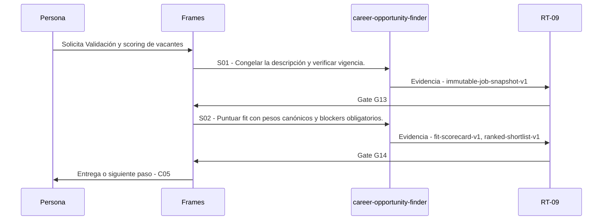

# C04 · Validación y scoring de vacantes

> Esta página se genera desde el workflow canónico. Para cambiarla, edita [su fuente](../../../02_proceso/workflows/career/c04-scoring/workflow.yml) y regenera la documentación.

## Qué puedes conseguir

Verificar vigencia, extraer requisitos y producir un score explicable con hard stops.

## Cuándo usarlo

Frames selecciona este recorrido cuando el resultado solicitado corresponde a **Validación y scoring de vacantes**. Comando equivalente: `/career-score`.

## Qué necesita

- `opportunity-inventory-v1`
- `evidence-bank-v1`
- `search-constraints-v1`

## Qué entrega

- `immutable-job-snapshot-v1`
- `fit-scorecard-v1`
- `ranked-shortlist-v1`

## Cómo avanza

| Paso | Qué ocurre                                               | Skill principal             | Resultado                             | Aprobación |
| ---- | -------------------------------------------------------- | --------------------------- | ------------------------------------- | ---------- |
| S01  | Congelar la descripción y verificar vigencia.            | `career-opportunity-finder` | immutable-job-snapshot-v1             | `G13`      |
| S02  | Puntuar fit con pesos canónicos y blockers obligatorios. | `career-opportunity-finder` | fit-scorecard-v1, ranked-shortlist-v1 | `G14`      |

## Diagrama de secuencia

### Alternativa textual

1. La persona solicita Validación y scoring de vacantes.
2. S01: career-opportunity-finder prepara immutable-job-snapshot-v1; RT-09 verifica; RT-09 decide G13.
3. S02: career-opportunity-finder prepara fit-scorecard-v1, ranked-shortlist-v1; RT-09 verifica; RT-09 decide G14.
4. Frames entrega el resultado y propone C05.

## Límites y detención

El score explica componentes; no sustituye decisión humana.

Gates: `G13`, `G14`. Solo una aprobación inequívoca permite avanzar.

## Siguiente paso

Si el resultado queda aprobado, Frames puede continuar con **C05**.
