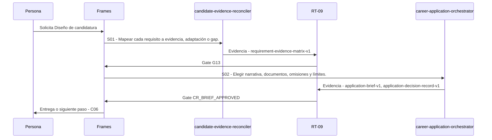

# C05 · Diseño de candidatura

> Esta página se genera desde el workflow canónico. Para cambiarla, edita [su fuente](../../../02_proceso/workflows/career/c05-application-design/workflow.yml) y regenera la documentación.

## Qué puedes conseguir

Fijar vacante, evidencia utilizable, gaps, narrativa y entregables antes de redactar.

## Cuándo usarlo

Frames selecciona este recorrido cuando el resultado solicitado corresponde a **Diseño de candidatura**. Comando equivalente: `/career-application-design`.

## Qué necesita

- `immutable-job-snapshot-v1`
- `evidence-bank-v1`
- `fit-scorecard-v1`

## Qué entrega

- `application-brief-v1`
- `requirement-evidence-matrix-v1`
- `application-decision-record-v1`

## Cómo avanza

| Paso | Qué ocurre                                           | Skill principal                   | Resultado                                            | Aprobación          |
| ---- | ---------------------------------------------------- | --------------------------------- | ---------------------------------------------------- | ------------------- |
| S01  | Mapear cada requisito a evidencia, adaptación o gap. | `candidate-evidence-reconciler`   | requirement-evidence-matrix-v1                       | `G13`               |
| S02  | Elegir narrativa, documentos, omisiones y límites.   | `career-application-orchestrator` | application-brief-v1, application-decision-record-v1 | `CR_BRIEF_APPROVED` |

## Diagrama de secuencia

### Alternativa textual

1. La persona solicita Diseño de candidatura.
2. S01: candidate-evidence-reconciler produce requirement-evidence-matrix-v1; RT-09 decide G13.
3. S02: career-application-orchestrator produce application-brief-v1, application-decision-record-v1; RT-09 decide CR_BRIEF_APPROVED.
4. Frames entrega el resultado y propone C06.

## Límites y detención

Gap obligatorio se declara y puede bloquear; nunca se maquilla.

Gates: `G13`, `CR_BRIEF_APPROVED`. Solo una aprobación inequívoca permite avanzar.

## Siguiente paso

Si el resultado queda aprobado, Frames puede continuar con **C06**.
