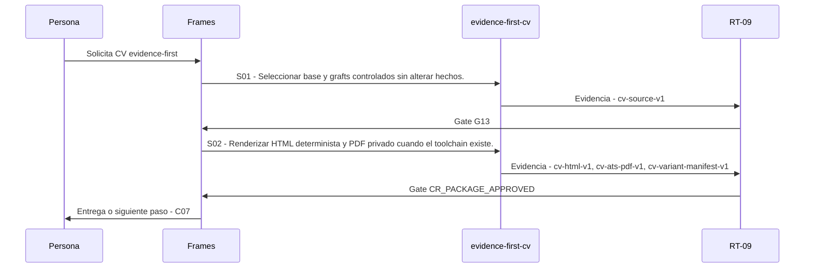

# C06 · CV evidence-first

> Esta página se genera desde el workflow canónico. Para cambiarla, edita [su fuente](../../../02_proceso/workflows/career/c06-cv/workflow.yml) y regenera la documentación.

## Qué puedes conseguir

Componer un CV recruiter-first, ATS-safe y trazable desde el brief y la evidencia seleccionada.

## Cuándo usarlo

Frames selecciona este recorrido cuando el resultado solicitado corresponde a **CV evidence-first**. Comando equivalente: `/career-cv`.

## Qué necesita

- `application-brief-v1`
- `requirement-evidence-matrix-v1`
- `evidence-bank-v1`

## Qué entrega

- `cv-source-v1`
- `cv-html-v1`
- `cv-ats-pdf-v1`
- `cv-variant-manifest-v1`

## Cómo avanza

| Paso | Qué ocurre                                                             | Skill principal     | Resultado                                         | Aprobación            |
| ---- | ---------------------------------------------------------------------- | ------------------- | ------------------------------------------------- | --------------------- |
| S01  | Seleccionar base y grafts controlados sin alterar hechos.              | `evidence-first-cv` | cv-source-v1                                      | `G13`                 |
| S02  | Renderizar HTML determinista y PDF privado cuando el toolchain existe. | `evidence-first-cv` | cv-html-v1, cv-ats-pdf-v1, cv-variant-manifest-v1 | `CR_PACKAGE_APPROVED` |

## Diagrama de secuencia

### Alternativa textual

1. La persona solicita CV evidence-first.
2. S01: evidence-first-cv produce cv-source-v1; RT-09 decide G13.
3. S02: evidence-first-cv produce cv-html-v1, cv-ats-pdf-v1, cv-variant-manifest-v1; RT-09 decide CR_PACKAGE_APPROVED.
4. Frames entrega el resultado y propone C07.

## Límites y detención

Render produce RENDERED_DRAFT; no concede aprobación ni envío.

Gates: `G13`, `CR_PACKAGE_APPROVED`. Solo una aprobación inequívoca permite avanzar.

## Siguiente paso

Si el resultado queda aprobado, Frames puede continuar con **C07**.
