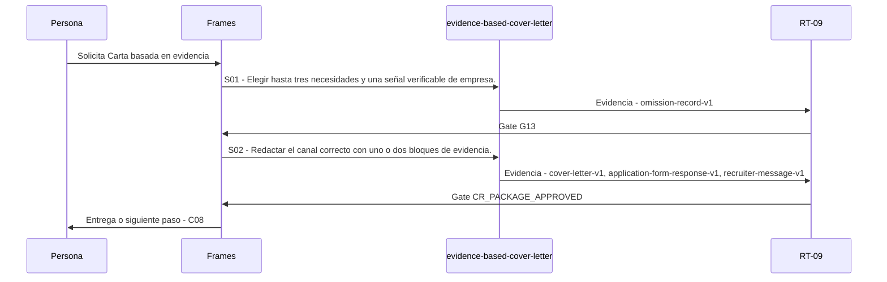

# C07 · Carta basada en evidencia

> Esta página se genera desde el workflow canónico. Para cambiarla, edita [su fuente](../../../02_proceso/workflows/career/c07-cover-letter/workflow.yml) y regenera la documentación.

## Qué puedes conseguir

Redactar carta, respuesta de formulario o mensaje que complemente el CV sin repetirlo.

## Cuándo usarlo

Frames selecciona este recorrido cuando el resultado solicitado corresponde a **Carta basada en evidencia**. Comando equivalente: `/career-cover-letter`.

## Qué necesita

- `application-brief-v1`
- `requirement-evidence-matrix-v1`
- `cv-source-v1`

## Qué entrega

- `cover-letter-v1`
- `application-form-response-v1`
- `recruiter-message-v1`
- `omission-record-v1`

## Cómo avanza

| Paso | Qué ocurre                                                        | Skill principal               | Resultado                                                           | Aprobación            |
| ---- | ----------------------------------------------------------------- | ----------------------------- | ------------------------------------------------------------------- | --------------------- |
| S01  | Elegir hasta tres necesidades y una señal verificable de empresa. | `evidence-based-cover-letter` | omission-record-v1                                                  | `G13`                 |
| S02  | Redactar el canal correcto con uno o dos bloques de evidencia.    | `evidence-based-cover-letter` | cover-letter-v1, application-form-response-v1, recruiter-message-v1 | `CR_PACKAGE_APPROVED` |

## Diagrama de secuencia

### Alternativa textual

1. La persona solicita Carta basada en evidencia.
2. S01: evidence-based-cover-letter prepara omission-record-v1; RT-09 verifica; RT-09 decide G13.
3. S02: evidence-based-cover-letter prepara cover-letter-v1, application-form-response-v1, recruiter-message-v1; RT-09 verifica; RT-09 decide CR_PACKAGE_APPROVED.
4. Frames entrega el resultado y propone C08.

## Límites y detención

La carta complementa; no inventa contacto, resultados futuros ni capacidades.

Gates: `G13`, `CR_PACKAGE_APPROVED`. Solo una aprobación inequívoca permite avanzar.

## Siguiente paso

Si el resultado queda aprobado, Frames puede continuar con **C08**.
