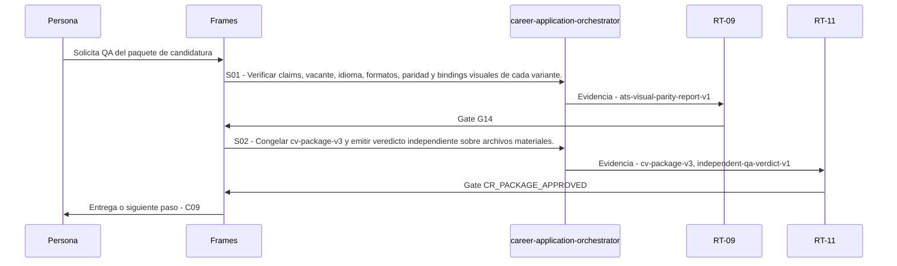

# C08 · QA del paquete de candidatura

> Esta página se genera desde el workflow canónico. Para cambiarla, edita [su fuente](../../../02_proceso/workflows/career/c08-package-qa/workflow.yml) y regenera la documentación.

## Qué puedes conseguir

Congelar y verificar spec, diseño, claims, idioma, ATS, legibilidad, privacidad, paridad y hashes antes de autorizar.

## Cuándo usarlo

Frames selecciona este recorrido cuando el resultado solicitado corresponde a **QA del paquete de candidatura**. Comando equivalente: `/career-package-qa`.

## Qué necesita

- `cv-spec-v2`
- `cv-source-v2`
- `cv-variant-manifest-v2`
- `career-evidence-readiness-v1`

### Precondiciones verificables

- `CR_CAREER_EVIDENCE_READY`

## Qué entrega

- `cv-package-v3`
- `ats-visual-parity-report-v1`
- `independent-qa-verdict-v1`

## Cómo avanza

| Paso | Qué ocurre                                                                                 | Skill principal                   | Resultado                                | Aprobación            |
| ---- | ------------------------------------------------------------------------------------------ | --------------------------------- | ---------------------------------------- | --------------------- |
| S01  | Verificar claims, vacante, idioma, formatos, paridad y bindings visuales de cada variante. | `career-application-orchestrator` | ats-visual-parity-report-v1              | `G14`                 |
| S02  | Congelar cv-package-v3 y emitir veredicto independiente sobre archivos materiales.         | `career-application-orchestrator` | cv-package-v3, independent-qa-verdict-v1 | `CR_PACKAGE_APPROVED` |

## Diagrama de secuencia

### Alternativa textual

1. La persona solicita QA del paquete de candidatura.
2. S01: career-application-orchestrator produce ats-visual-parity-report-v1; RT-09 decide G14.
3. S02: career-application-orchestrator produce cv-package-v3, independent-qa-verdict-v1; RT-11 decide CR_PACKAGE_APPROVED.
4. Frames entrega el resultado y propone C09.

## Límites y detención

Cualquier mutación de spec, sistema visual, decisión, evidencia, vacante o contenido crea successor package y nueva revisión por hash stale.

Gates: `CR_CAREER_EVIDENCE_READY`, `G14`, `CR_PACKAGE_APPROVED`. Solo una aprobación inequívoca permite avanzar.

## Siguiente paso

Si el resultado queda aprobado, Frames puede continuar con **C09**.
