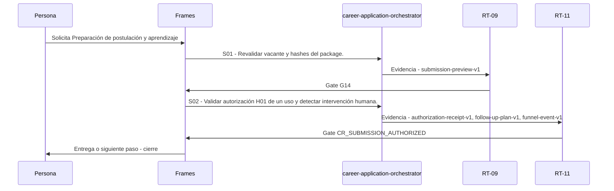

# C09 · Preparación de postulación y aprendizaje

> Esta página se genera desde el workflow canónico. Para cambiarla, edita [su fuente](../../../02_proceso/workflows/career/c09-submission/workflow.yml) y regenera la documentación.

## Qué puedes conseguir

Revalidar, mostrar preview, comprobar autorización y preparar seguimiento sin enviar desde local-evaluation.

## Cuándo usarlo

Frames selecciona este recorrido cuando el resultado solicitado corresponde a **Preparación de postulación y aprendizaje**. Comando equivalente: `/career-submission`.

## Qué necesita

- `application-package-v1`
- `immutable-job-snapshot-v1`

## Qué entrega

- `submission-preview-v1`
- `authorization-receipt-v1`
- `submission-receipt-v1`
- `follow-up-plan-v1`
- `funnel-event-v1`

## Cómo avanza

| Paso | Qué ocurre                                                         | Skill principal                   | Resultado                                                    | Aprobación                 |
| ---- | ------------------------------------------------------------------ | --------------------------------- | ------------------------------------------------------------ | -------------------------- |
| S01  | Revalidar vacante y hashes del package.                            | `career-application-orchestrator` | submission-preview-v1                                        | `G14`                      |
| S02  | Validar autorización H01 de un uso y detectar intervención humana. | `career-application-orchestrator` | authorization-receipt-v1, follow-up-plan-v1, funnel-event-v1 | `CR_SUBMISSION_AUTHORIZED` |

## Diagrama de secuencia

### Alternativa textual

1. La persona solicita Preparación de postulación y aprendizaje.
2. S01: career-application-orchestrator prepara submission-preview-v1; RT-09 verifica; RT-09 decide G14.
3. S02: career-application-orchestrator prepara authorization-receipt-v1, follow-up-plan-v1, funnel-event-v1; RT-11 verifica; RT-11 decide CR_SUBMISSION_AUTHORIZED.
4. Frames entrega el resultado y cierra el recorrido.

## Límites y detención

PREPARED_STOP obligatorio; no enviar, contactar ni marcar SUBMITTED sin receipt externo material.

Gates: `G14`, `CR_SUBMISSION_AUTHORIZED`. Solo una aprobación inequívoca permite avanzar.

## Siguiente paso

Este workflow cierra su familia. Cualquier efecto externo requiere una autorización separada.
