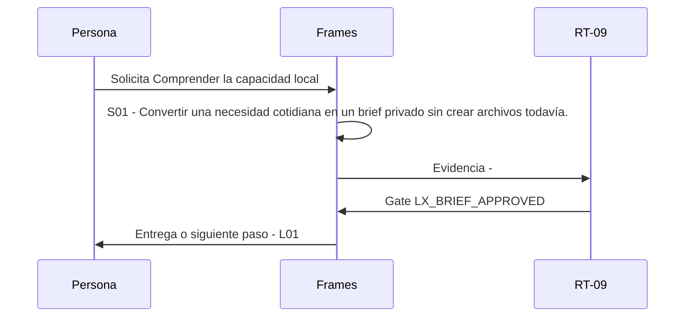

# L00 · Comprender la capacidad local

> Esta página se genera desde el workflow canónico. Para cambiarla, edita [su fuente](../../../02_proceso/workflows/local-extensions/l00-intake/workflow.yml) y regenera la documentación.

## Qué puedes conseguir

Convertir una necesidad cotidiana en un brief privado sin crear archivos todavía.

## Cuándo usarlo

Frames selecciona este recorrido cuando el resultado solicitado corresponde a **Comprender la capacidad local**. Comando equivalente: `No disponible`.

## Qué necesita

- `assistance-envelope-v1`

## Qué entrega

- Ninguno declarado.

## Cómo avanza

| Paso | Qué ocurre                                                                        | Skill principal | Resultado | Aprobación          |
| ---- | --------------------------------------------------------------------------------- | --------------- | --------- | ------------------- |
| S01  | Convertir una necesidad cotidiana en un brief privado sin crear archivos todavía. | `Frames`        | Evidencia | `LX_BRIEF_APPROVED` |

## Diagrama de secuencia

### Alternativa textual

1. La persona solicita Comprender la capacidad local.
2. S01: Frames prepara evidencia; RT-09 verifica; RT-09 decide LX_BRIEF_APPROVED.
3. Frames entrega el resultado y propone L01.

## Límites y detención

Preguntar como máximo tres datos bloqueantes y detener antes de materializar.

Gates: `LX_BRIEF_APPROVED`. Solo una aprobación inequívoca permite avanzar.

## Siguiente paso

Si el resultado queda aprobado, Frames puede continuar con **L01**.
