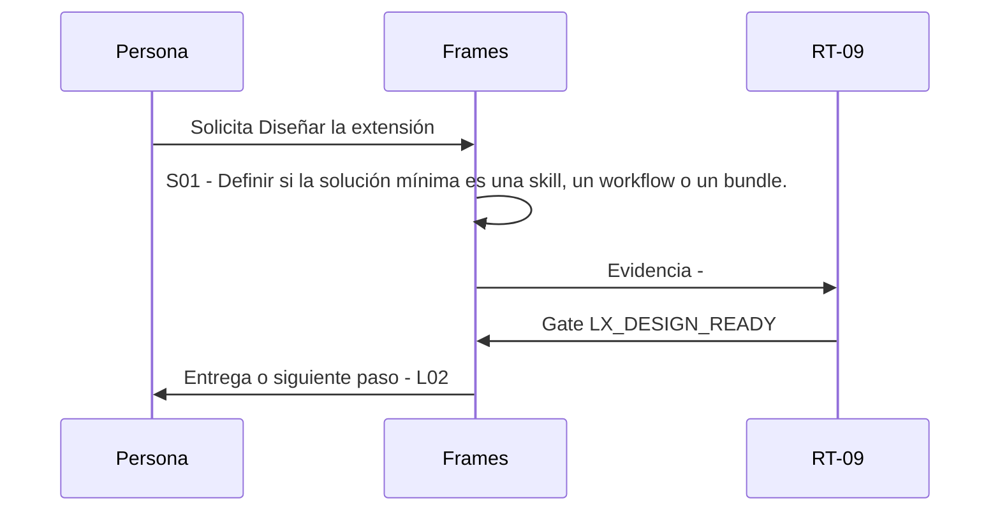

# L01 · Diseñar la extensión

> Esta página se genera desde el workflow canónico. Para cambiarla, edita [su fuente](../../../02_proceso/workflows/local-extensions/l01-design/workflow.yml) y regenera la documentación.

## Qué puedes conseguir

Definir si la solución mínima es una skill, un workflow o un bundle.

## Cuándo usarlo

Frames selecciona este recorrido cuando el resultado solicitado corresponde a **Diseñar la extensión**. Comando equivalente: `No disponible`.

## Qué necesita

- `local-extension-brief-v1`

## Qué entrega

- Ninguno declarado.

## Cómo avanza

| Paso | Qué ocurre                                                           | Skill principal | Resultado | Aprobación        |
| ---- | -------------------------------------------------------------------- | --------------- | --------- | ----------------- |
| S01  | Definir si la solución mínima es una skill, un workflow o un bundle. | `Frames`        | Evidencia | `LX_DESIGN_READY` |

## Diagrama de secuencia

### Alternativa textual

1. La persona solicita Diseñar la extensión.
2. S01: Frames prepara evidencia; RT-09 verifica; RT-09 decide LX_DESIGN_READY.
3. Frames entrega el resultado y propone L02.

## Límites y detención

Bloquear IDs no locales, overrides y capacidades sin owner o límites.

Gates: `LX_DESIGN_READY`. Solo una aprobación inequívoca permite avanzar.

## Siguiente paso

Si el resultado queda aprobado, Frames puede continuar con **L02**.
