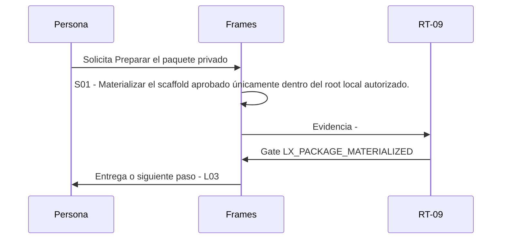

# L02 · Preparar el paquete privado

> Esta página se genera desde el workflow canónico. Para cambiarla, edita [su fuente](../../../02_proceso/workflows/local-extensions/l02-scaffold/workflow.yml) y regenera la documentación.

## Qué puedes conseguir

Materializar el scaffold aprobado únicamente dentro del root local autorizado.

## Cuándo usarlo

Frames selecciona este recorrido cuando el resultado solicitado corresponde a **Preparar el paquete privado**. Comando equivalente: `No disponible`.

## Qué necesita

- `local-extension-design-v1`

## Qué entrega

- Ninguno declarado.

## Cómo avanza

| Paso | Qué ocurre                                                                     | Skill principal | Resultado | Aprobación                |
| ---- | ------------------------------------------------------------------------------ | --------------- | --------- | ------------------------- |
| S01  | Materializar el scaffold aprobado únicamente dentro del root local autorizado. | `Frames`        | Evidencia | `LX_PACKAGE_MATERIALIZED` |

## Diagrama de secuencia

### Alternativa textual

1. La persona solicita Preparar el paquete privado.
2. S01: Frames produce evidencia; RT-09 decide LX_PACKAGE_MATERIALIZED.
3. Frames entrega el resultado y propone L03.

## Límites y detención

Un path inseguro, symlink o write fuera del root bloquea sin dejar estado parcial.

Gates: `LX_PACKAGE_MATERIALIZED`. Solo una aprobación inequívoca permite avanzar.

## Siguiente paso

Si el resultado queda aprobado, Frames puede continuar con **L03**.
