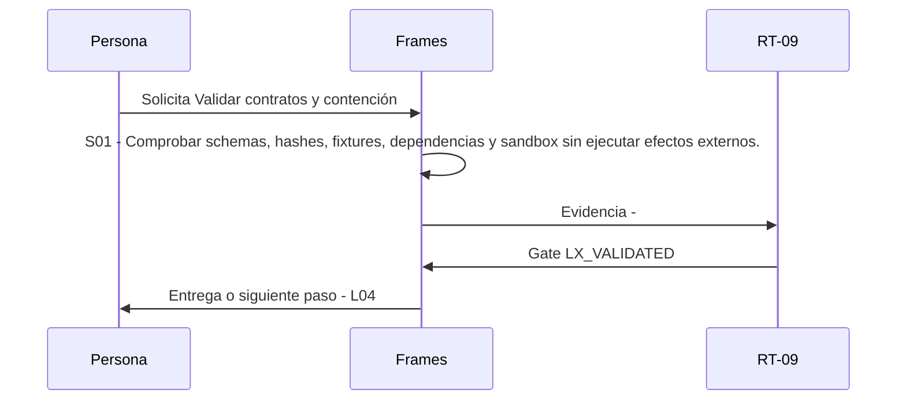

# L03 · Validar contratos y contención

> Esta página se genera desde el workflow canónico. Para cambiarla, edita [su fuente](../../../02_proceso/workflows/local-extensions/l03-validate/workflow.yml) y regenera la documentación.

## Qué puedes conseguir

Comprobar schemas, hashes, fixtures, dependencias y sandbox sin ejecutar efectos externos.

## Cuándo usarlo

Frames selecciona este recorrido cuando el resultado solicitado corresponde a **Validar contratos y contención**. Comando equivalente: `No disponible`.

## Qué necesita

- `local-extension-package-v1`

## Qué entrega

- Ninguno declarado.

## Cómo avanza

| Paso | Qué ocurre                                                                                 | Skill principal | Resultado | Aprobación     |
| ---- | ------------------------------------------------------------------------------------------ | --------------- | --------- | -------------- |
| S01  | Comprobar schemas, hashes, fixtures, dependencias y sandbox sin ejecutar efectos externos. | `Frames`        | Evidencia | `LX_VALIDATED` |

## Diagrama de secuencia

### Alternativa textual

1. La persona solicita Validar contratos y contención.
2. S01: Frames produce evidencia; RT-09 decide LX_VALIDATED.
3. Frames entrega el resultado y propone L04.

## Límites y detención

Código sin probe material queda VALIDATED_NOT_RUNNABLE; UNKNOWN bloquea.

Gates: `LX_VALIDATED`. Solo una aprobación inequívoca permite avanzar.

## Siguiente paso

Si el resultado queda aprobado, Frames puede continuar con **L04**.
