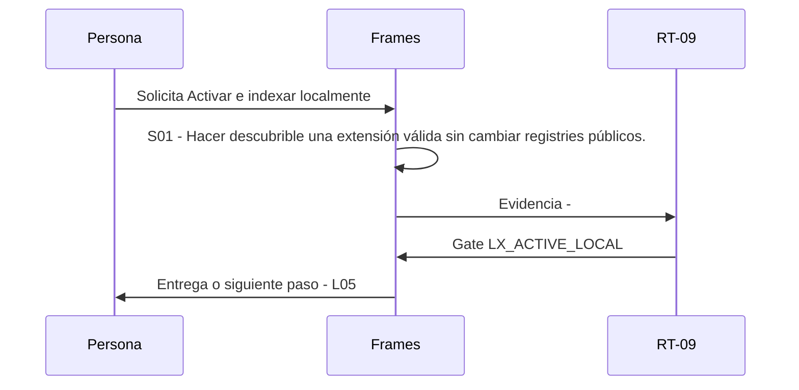

# L04 · Activar e indexar localmente

> Esta página se genera desde el workflow canónico. Para cambiarla, edita [su fuente](../../../02_proceso/workflows/local-extensions/l04-activate/workflow.yml) y regenera la documentación.

## Qué puedes conseguir

Hacer descubrible una extensión válida sin cambiar registries públicos.

## Cuándo usarlo

Frames selecciona este recorrido cuando el resultado solicitado corresponde a **Activar e indexar localmente**. Comando equivalente: `No disponible`.

## Qué necesita

- `local-extension-validation-v1`

## Qué entrega

- Ninguno declarado.

## Cómo avanza

| Paso | Qué ocurre                                                              | Skill principal | Resultado | Aprobación        |
| ---- | ----------------------------------------------------------------------- | --------------- | --------- | ----------------- |
| S01  | Hacer descubrible una extensión válida sin cambiar registries públicos. | `Frames`        | Evidencia | `LX_ACTIVE_LOCAL` |

## Diagrama de secuencia

### Alternativa textual

1. La persona solicita Activar e indexar localmente.
2. S01: Frames produce evidencia; RT-09 decide LX_ACTIVE_LOCAL.
3. Frames entrega el resultado y propone L05.

## Límites y detención

Colisiones, hashes stale o dependencias ausentes dejan la extensión BLOCKED.

Gates: `LX_ACTIVE_LOCAL`. Solo una aprobación inequívoca permite avanzar.

## Siguiente paso

Si el resultado queda aprobado, Frames puede continuar con **L05**.
