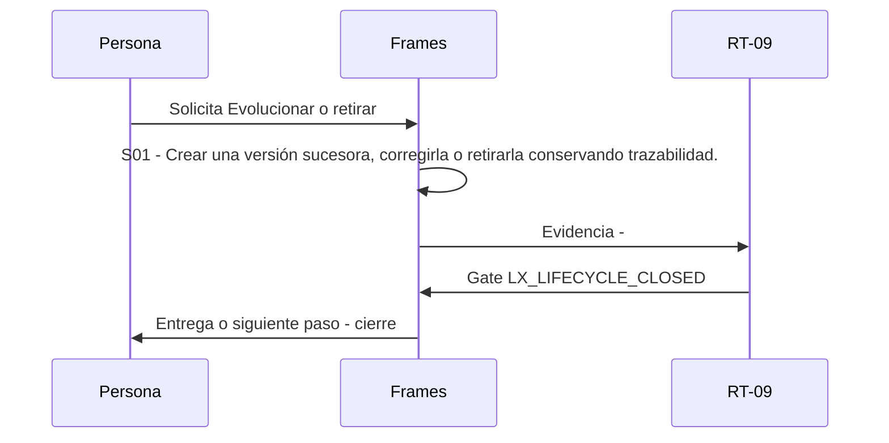

# L05 · Evolucionar o retirar

> Esta página se genera desde el workflow canónico. Para cambiarla, edita [su fuente](../../../02_proceso/workflows/local-extensions/l05-evolve/workflow.yml) y regenera la documentación.

## Qué puedes conseguir

Crear una versión sucesora, corregirla o retirarla conservando trazabilidad.

## Cuándo usarlo

Frames selecciona este recorrido cuando el resultado solicitado corresponde a **Evolucionar o retirar**. Comando equivalente: `No disponible`.

## Qué necesita

- `local-activation-receipt-v1`

## Qué entrega

- Ninguno declarado.

## Cómo avanza

| Paso | Qué ocurre                                                                   | Skill principal | Resultado | Aprobación            |
| ---- | ---------------------------------------------------------------------------- | --------------- | --------- | --------------------- |
| S01  | Crear una versión sucesora, corregirla o retirarla conservando trazabilidad. | `Frames`        | Evidencia | `LX_LIFECYCLE_CLOSED` |

## Diagrama de secuencia

### Alternativa textual

1. La persona solicita Evolucionar o retirar.
2. S01: Frames produce evidencia; RT-09 decide LX_LIFECYCLE_CLOSED.
3. Frames entrega el resultado y cierra el recorrido.

## Límites y detención

Promover al repositorio requiere un proceso H-03 separado y aprobación humana.

Gates: `LX_LIFECYCLE_CLOSED`. Solo una aprobación inequívoca permite avanzar.

## Siguiente paso

Este workflow cierra su familia. Cualquier efecto externo requiere una autorización separada.
