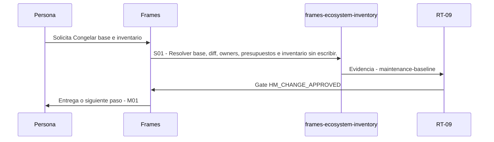

# M00 · Congelar base e inventario

> Esta página se genera desde el workflow canónico. Para cambiarla, edita [su fuente](../../../02_proceso/workflows/maintenance/m00-freeze/workflow.yml) y regenera la documentación.

## Qué puedes conseguir

Capturar base, estado, ownership e inventario antes de diagnosticar o cambiar Frames.

## Cuándo usarlo

Frames selecciona este recorrido cuando el resultado solicitado corresponde a **Congelar base e inventario**. Comando equivalente: `No disponible`.

## Qué necesita

- Ninguno declarado.

## Qué entrega

- Ninguno declarado.

## Cómo avanza

| Paso | Qué ocurre                                                           | Skill principal              | Resultado            | Aprobación           |
| ---- | -------------------------------------------------------------------- | ---------------------------- | -------------------- | -------------------- |
| S01  | Resolver base, diff, owners, presupuestos e inventario sin escribir. | `frames-ecosystem-inventory` | maintenance-baseline | `HM_CHANGE_APPROVED` |

## Diagrama de secuencia

### Alternativa textual

1. La persona solicita Congelar base e inventario.
2. S01: frames-ecosystem-inventory produce maintenance-baseline; RT-09 decide HM_CHANGE_APPROVED.
3. Frames entrega el resultado y propone M01.

## Límites y detención

Esta etapa es read-only y no concede autoridad de cambio.

Gates: `UNKNOWN`. Solo una aprobación inequívoca permite avanzar.

## Siguiente paso

Si el resultado queda aprobado, Frames puede continuar con **M01**.
