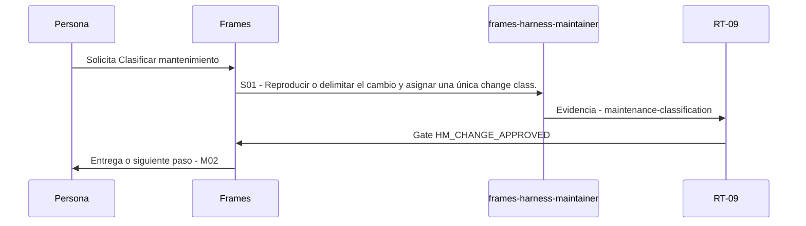

# M01 · Clasificar mantenimiento

> Esta página se genera desde el workflow canónico. Para cambiarla, edita [su fuente](../../../02_proceso/workflows/maintenance/m01-classify/workflow.yml) y regenera la documentación.

## Qué puedes conseguir

Separar defecto, deuda, evolución, migración o deprecación y fijar su impacto observable.

## Cuándo usarlo

Frames selecciona este recorrido cuando el resultado solicitado corresponde a **Clasificar mantenimiento**. Comando equivalente: `No disponible`.

## Qué necesita

- Ninguno declarado.

## Qué entrega

- Ninguno declarado.

## Cómo avanza

| Paso | Qué ocurre                                                         | Skill principal             | Resultado                  | Aprobación           |
| ---- | ------------------------------------------------------------------ | --------------------------- | -------------------------- | -------------------- |
| S01  | Reproducir o delimitar el cambio y asignar una única change class. | `frames-harness-maintainer` | maintenance-classification | `HM_CHANGE_APPROVED` |

## Diagrama de secuencia

### Alternativa textual

1. La persona solicita Clasificar mantenimiento.
2. S01: frames-harness-maintainer produce maintenance-classification; RT-09 decide HM_CHANGE_APPROVED.
3. Frames entrega el resultado y propone M02.

## Límites y detención

No implementar durante la clasificación.

Gates: `UNKNOWN`. Solo una aprobación inequívoca permite avanzar.

## Siguiente paso

Si el resultado queda aprobado, Frames puede continuar con **M02**.
