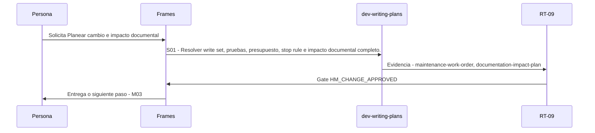

# M02 · Planear cambio e impacto documental

> Esta página se genera desde el workflow canónico. Para cambiarla, edita [su fuente](../../../02_proceso/workflows/maintenance/m02-plan/workflow.yml) y regenera la documentación.

## Qué puedes conseguir

Producir WorkOrder, aceptación, rollback y DocumentationImpactPlan antes de editar.

## Cuándo usarlo

Frames selecciona este recorrido cuando el resultado solicitado corresponde a **Planear cambio e impacto documental**. Comando equivalente: `No disponible`.

## Qué necesita

- Ninguno declarado.

## Qué entrega

- Ninguno declarado.

## Cómo avanza

| Paso | Qué ocurre                                                                         | Skill principal     | Resultado                                         | Aprobación           |
| ---- | ---------------------------------------------------------------------------------- | ------------------- | ------------------------------------------------- | -------------------- |
| S01  | Resolver write set, pruebas, presupuesto, stop rule e impacto documental completo. | `dev-writing-plans` | maintenance-work-order, documentation-impact-plan | `HM_CHANGE_APPROVED` |

## Diagrama de secuencia

### Alternativa textual

1. La persona solicita Planear cambio e impacto documental.
2. S01: dev-writing-plans produce maintenance-work-order, documentation-impact-plan; RT-09 decide HM_CHANGE_APPROVED.
3. Frames entrega el resultado y propone M03.

## Límites y detención

Requiere HM_CHANGE_APPROVED antes de escribir.

Gates: `UNKNOWN`. Solo una aprobación inequívoca permite avanzar.

## Siguiente paso

Si el resultado queda aprobado, Frames puede continuar con **M03**.
