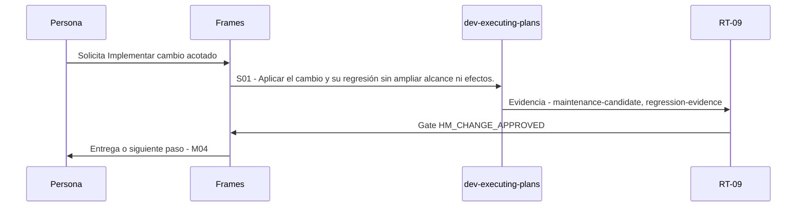

# M03 · Implementar cambio acotado

> Esta página se genera desde el workflow canónico. Para cambiarla, edita [su fuente](../../../02_proceso/workflows/maintenance/m03-implement/workflow.yml) y regenera la documentación.

## Qué puedes conseguir

Ejecutar el WorkOrder aprobado en rutas, efectos y presupuesto autorizados.

## Cuándo usarlo

Frames selecciona este recorrido cuando el resultado solicitado corresponde a **Implementar cambio acotado**. Comando equivalente: `No disponible`.

## Qué necesita

- Ninguno declarado.

## Qué entrega

- `maintenance-candidate`
- `regression-evidence`

## Cómo avanza

| Paso | Qué ocurre                                                       | Skill principal       | Resultado                                  | Aprobación           |
| ---- | ---------------------------------------------------------------- | --------------------- | ------------------------------------------ | -------------------- |
| S01  | Aplicar el cambio y su regresión sin ampliar alcance ni efectos. | `dev-executing-plans` | maintenance-candidate, regression-evidence | `HM_CHANGE_APPROVED` |

## Diagrama de secuencia

### Alternativa textual

1. La persona solicita Implementar cambio acotado.
2. S01: dev-executing-plans prepara maintenance-candidate, regression-evidence; RT-09 verifica; RT-09 decide HM_CHANGE_APPROVED.
3. Frames entrega el resultado y propone M04.

## Límites y detención

No promover ni documentar PASS antes de verificación fresca.

Gates: `HM_CHANGE_APPROVED`. Solo una aprobación inequívoca permite avanzar.

## Siguiente paso

Si el resultado queda aprobado, Frames puede continuar con **M04**.
