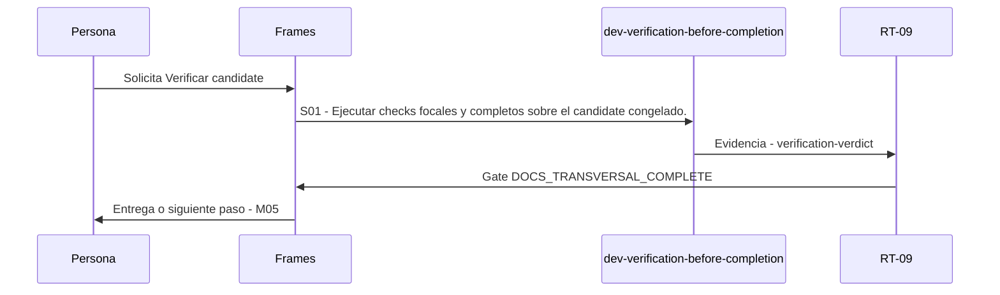

# M04 · Verificar candidate

> Esta página se genera desde el workflow canónico. Para cambiarla, edita [su fuente](../../../02_proceso/workflows/maintenance/m04-verify/workflow.yml) y regenera la documentación.

## Qué puedes conseguir

Congelar candidate y comprobar requisitos, regresión, privacidad, ownership y budgets.

## Cuándo usarlo

Frames selecciona este recorrido cuando el resultado solicitado corresponde a **Verificar candidate**. Comando equivalente: `No disponible`.

## Qué necesita

- Ninguno declarado.

## Qué entrega

- Ninguno declarado.

## Cómo avanza

| Paso | Qué ocurre                                                        | Skill principal                      | Resultado            | Aprobación                  |
| ---- | ----------------------------------------------------------------- | ------------------------------------ | -------------------- | --------------------------- |
| S01  | Ejecutar checks focales y completos sobre el candidate congelado. | `dev-verification-before-completion` | verification-verdict | `DOCS_TRANSVERSAL_COMPLETE` |

## Diagrama de secuencia

### Alternativa textual

1. La persona solicita Verificar candidate.
2. S01: dev-verification-before-completion produce verification-verdict; RT-09 decide DOCS_TRANSVERSAL_COMPLETE.
3. Frames entrega el resultado y propone M05.

## Límites y detención

RT-09 no remedia el candidate que verifica.

Gates: `UNKNOWN`. Solo una aprobación inequívoca permite avanzar.

## Siguiente paso

Si el resultado queda aprobado, Frames puede continuar con **M05**.
