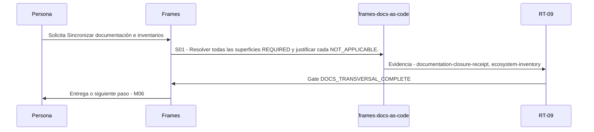

# M05 · Sincronizar documentación e inventarios

> Esta página se genera desde el workflow canónico. Para cambiarla, edita [su fuente](../../../02_proceso/workflows/maintenance/m05-sync-docs/workflow.yml) y regenera la documentación.

## Qué puedes conseguir

Actualizar fuentes aplicables y regenerar portal, secuencias, índices e inventarios.

## Cuándo usarlo

Frames selecciona este recorrido cuando el resultado solicitado corresponde a **Sincronizar documentación e inventarios**. Comando equivalente: `No disponible`.

## Qué necesita

- Ninguno declarado.

## Qué entrega

- Ninguno declarado.

## Cómo avanza

| Paso | Qué ocurre                                                                | Skill principal       | Resultado                                          | Aprobación                  |
| ---- | ------------------------------------------------------------------------- | --------------------- | -------------------------------------------------- | --------------------------- |
| S01  | Resolver todas las superficies REQUIRED y justificar cada NOT_APPLICABLE. | `frames-docs-as-code` | documentation-closure-receipt, ecosystem-inventory | `DOCS_TRANSVERSAL_COMPLETE` |

## Diagrama de secuencia

### Alternativa textual

1. La persona solicita Sincronizar documentación e inventarios.
2. S01: frames-docs-as-code produce documentation-closure-receipt, ecosystem-inventory; RT-09 decide DOCS_TRANSVERSAL_COMPLETE.
3. Frames entrega el resultado y propone M06.

## Límites y detención

No editar manualmente outputs generados.

Gates: `UNKNOWN`. Solo una aprobación inequívoca permite avanzar.

## Siguiente paso

Si el resultado queda aprobado, Frames puede continuar con **M06**.
