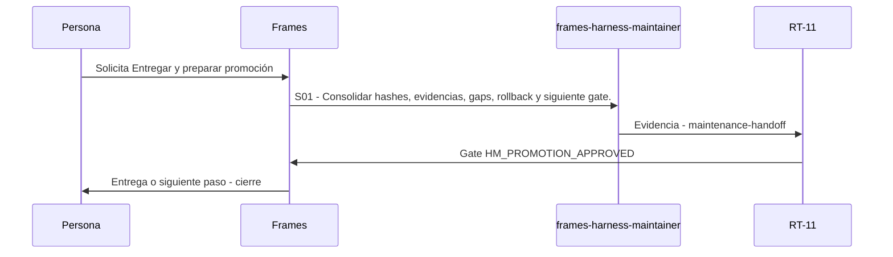

# M06 · Entregar y preparar promoción

> Esta página se genera desde el workflow canónico. Para cambiarla, edita [su fuente](../../../02_proceso/workflows/maintenance/m06-handoff/workflow.yml) y regenera la documentación.

## Qué puedes conseguir

Emitir handoff, rollback y límites sin confundir validación, merge o publicación.

## Cuándo usarlo

Frames selecciona este recorrido cuando el resultado solicitado corresponde a **Entregar y preparar promoción**. Comando equivalente: `No disponible`.

## Qué necesita

- Ninguno declarado.

## Qué entrega

- Ninguno declarado.

## Cómo avanza

| Paso | Qué ocurre                                                      | Skill principal             | Resultado           | Aprobación              |
| ---- | --------------------------------------------------------------- | --------------------------- | ------------------- | ----------------------- |
| S01  | Consolidar hashes, evidencias, gaps, rollback y siguiente gate. | `frames-harness-maintainer` | maintenance-handoff | `HM_PROMOTION_APPROVED` |

## Diagrama de secuencia

### Alternativa textual

1. La persona solicita Entregar y preparar promoción.
2. S01: frames-harness-maintainer produce maintenance-handoff; RT-11 decide HM_PROMOTION_APPROVED.
3. Frames entrega el resultado y cierra el recorrido.

## Límites y detención

Detener en HM_PROMOTION_APPROVED.

Gates: `UNKNOWN`. Solo una aprobación inequívoca permite avanzar.

## Siguiente paso

Este workflow cierra su familia. Cualquier efecto externo requiere una autorización separada.
