# P00 · Define tu sistema creativo

> Esta página se genera desde el workflow canónico. Para cambiarla, edita [su fuente](../../../02_proceso/workflows/multimedia/p00-definir-sistema/workflow.yml) y regenera la documentación.

## Qué puedes conseguir

Define perfil, Brand OS, voz o piloto, una modalidad por vez y bajo aprobación.

## Cuándo usarlo

Frames selecciona este recorrido cuando el resultado solicitado corresponde a **Define tu sistema creativo**. Comando equivalente: `/definir-sistema`.

## Qué necesita

- Ninguno declarado.

## Qué entrega

- `brand-charter-v1`
- `brand-os-v1`
- `calibration-sample-v1`
- `pilot-plan-v1`

## Cómo avanza

| Paso | Qué ocurre                                           | Skill principal            | Resultado                     | Aprobación |
| ---- | ---------------------------------------------------- | -------------------------- | ----------------------------- | ---------- |
| S01  | Resolver identidad y autoridad de marca.             | `metodologia-brand-router` | brand-charter-v1, brand-os-v1 | `G13`      |
| S02  | Definir voz, canal y audiencia sin mezclar perfiles. | `content-os-core`          | calibration-sample-v1         | `G13`      |
| S03  | Fijar tokens creativos y restricciones del piloto.   | `dev-writing-plans`        | pilot-plan-v1                 | `G14`      |

## Diagrama de secuencia

```mermaid
sequenceDiagram
  participant a0_Persona as Persona
  participant a1_Frames as Frames
  participant a2_metodologia_brand_router as metodologia-brand-router
  participant a3_RT_09 as RT-09
  participant a4_content_os_core as content-os-core
  participant a5_dev_writing_plans as dev-writing-plans
  a0_Persona->>a1_Frames: Solicita Define tu sistema creativo
  a1_Frames->>a2_metodologia_brand_router: S01 - Resolver identidad y autoridad de marca.
  a2_metodologia_brand_router->>a3_RT_09: Evidencia - brand-charter-v1, brand-os-v1
  a3_RT_09->>a1_Frames: Gate G13
  a1_Frames->>a4_content_os_core: S02 - Definir voz, canal y audiencia sin mezclar perfiles.
  a4_content_os_core->>a3_RT_09: Evidencia - calibration-sample-v1
  a3_RT_09->>a1_Frames: Gate G13
  a1_Frames->>a5_dev_writing_plans: S03 - Fijar tokens creativos y restricciones del piloto.
  a5_dev_writing_plans->>a3_RT_09: Evidencia - pilot-plan-v1
  a3_RT_09->>a1_Frames: Gate G14
  a1_Frames->>a0_Persona: Entrega o siguiente paso - P01
```

### Alternativa textual

1. La persona solicita Define tu sistema creativo.
2. S01: metodologia-brand-router prepara brand-charter-v1, brand-os-v1; RT-09 verifica; RT-09 decide G13.
3. S02: content-os-core prepara calibration-sample-v1; RT-09 verifica; RT-09 decide G13.
4. S03: dev-writing-plans prepara pilot-plan-v1; RT-09 verifica; RT-09 decide G14.
5. Frames entrega el resultado y propone P01.

## Límites y detención

Si el contexto es insuficiente, entrega el artefacto mínimo provisional y las tres preguntas de mayor impacto; si falta consentimiento o existe mezcla de perfiles, detén el proceso. interpreta, planifica, ejecuta.

Gates: `G13`, `G14`. Solo una aprobación inequívoca permite avanzar.

## Siguiente paso

Si el resultado queda aprobado, Frames puede continuar con **P01**.
