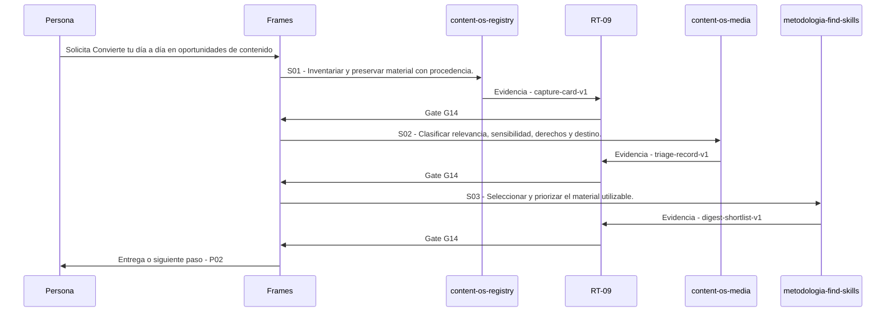

# P01 · Convierte tu día a día en oportunidades de contenido

> Esta página se genera desde el workflow canónico. Para cambiarla, edita [su fuente](../../../02_proceso/workflows/multimedia/p01-curar-material/workflow.yml) y regenera la documentación.

## Qué puedes conseguir

Convierte material cotidiano en oportunidades trazables sin obligar a publicarlo.

## Cuándo usarlo

Frames selecciona este recorrido cuando el resultado solicitado corresponde a **Convierte tu día a día en oportunidades de contenido**. Comando equivalente: `/curar-material`.

## Qué necesita

- `p00-definir-sistema/workflow.yml`

## Qué entrega

- `capture-card-v1`
- `triage-record-v1`
- `digest-shortlist-v1`

## Cómo avanza

| Paso | Qué ocurre                                               | Skill principal           | Resultado           | Aprobación |
| ---- | -------------------------------------------------------- | ------------------------- | ------------------- | ---------- |
| S01  | Inventariar y preservar material con procedencia.        | `content-os-registry`     | capture-card-v1     | `G14`      |
| S02  | Clasificar relevancia, sensibilidad, derechos y destino. | `content-os-media`        | triage-record-v1    | `G14`      |
| S03  | Seleccionar y priorizar el material utilizable.          | `metodologia-find-skills` | digest-shortlist-v1 | `G14`      |

## Diagrama de secuencia

### Alternativa textual

1. La persona solicita Convierte tu día a día en oportunidades de contenido.
2. S01: content-os-registry prepara capture-card-v1; RT-09 verifica; RT-09 decide G14.
3. S02: content-os-media prepara triage-record-v1; RT-09 verifica; RT-09 decide G14.
4. S03: metodologia-find-skills prepara digest-shortlist-v1; RT-09 verifica; RT-09 decide G14.
5. Frames entrega el resultado y propone P02.

## Límites y detención

Cuando el material sea insuficiente, acumúlalo y propone la captura mínima que permitiría evaluarlo; cuando exista riesgo, protege antes de producir. interpreta, planifica, ejecuta.

Gates: `G14`. Solo una aprobación inequívoca permite avanzar.

## Siguiente paso

Si el resultado queda aprobado, Frames puede continuar con **P02**.
