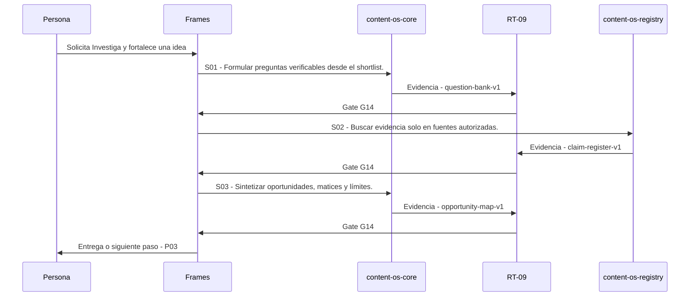

# P02 · Investiga y fortalece una idea

> Esta página se genera desde el workflow canónico. Para cambiarla, edita [su fuente](../../../02_proceso/workflows/multimedia/p02-investigar/workflow.yml) y regenera la documentación.

## Qué puedes conseguir

Verifica claims, encuentra matices y convierte fuentes en decisiones editoriales.

## Cuándo usarlo

Frames selecciona este recorrido cuando el resultado solicitado corresponde a **Investiga y fortalece una idea**. Comando equivalente: `/investigar`.

## Qué necesita

- `p01-curar-material/workflow.yml`

## Qué entrega

- `claim-register-v1`
- `opportunity-map-v1`
- `question-bank-v1`

## Cómo avanza

| Paso | Qué ocurre                                          | Skill principal       | Resultado          | Aprobación |
| ---- | --------------------------------------------------- | --------------------- | ------------------ | ---------- |
| S01  | Formular preguntas verificables desde el shortlist. | `content-os-core`     | question-bank-v1   | `G14`      |
| S02  | Buscar evidencia solo en fuentes autorizadas.       | `content-os-registry` | claim-register-v1  | `G14`      |
| S03  | Sintetizar oportunidades, matices y límites.        | `content-os-core`     | opportunity-map-v1 | `G14`      |

## Diagrama de secuencia

### Alternativa textual

1. La persona solicita Investiga y fortalece una idea.
2. S01: content-os-core produce question-bank-v1; RT-09 decide G14.
3. S02: content-os-registry produce claim-register-v1; RT-09 decide G14.
4. S03: content-os-core produce opportunity-map-v1; RT-09 decide G14.
5. Frames entrega el resultado y propone P03.

## Límites y detención

Sin fuentes suficientes, reformula como experiencia, pregunta o hipótesis y entrega la lista mínima de verificación; ante alto riesgo, HOLD. interpreta, planifica, ejecuta.

Gates: `G14`. Solo una aprobación inequívoca permite avanzar.

## Siguiente paso

Si el resultado queda aprobado, Frames puede continuar con **P03**.
