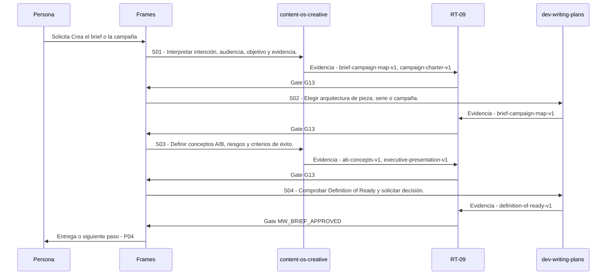

# P03 · Crea el brief o la campaña

> Esta página se genera desde el workflow canónico. Para cambiarla, edita [su fuente](../../../02_proceso/workflows/multimedia/p03-crear-brief/workflow.yml) y regenera la documentación.

## Qué puedes conseguir

Define una pieza, sistema de derivados, serie o campaña con funciones distintas.

## Cuándo usarlo

Frames selecciona este recorrido cuando el resultado solicitado corresponde a **Crea el brief o la campaña**. Comando equivalente: `/crear-brief`.

## Qué necesita

- `p02-investigar/workflow.yml`

## Qué entrega

- `brief-campaign-map-v1`
- `campaign-charter-v1`
- `executive-presentation-v1`
- `ab-concepts-v1`
- `definition-of-ready-v1`

## Cómo avanza

| Paso | Qué ocurre                                              | Skill principal       | Resultado                                  | Aprobación          |
| ---- | ------------------------------------------------------- | --------------------- | ------------------------------------------ | ------------------- |
| S01  | Interpretar intención, audiencia, objetivo y evidencia. | `content-os-creative` | brief-campaign-map-v1, campaign-charter-v1 | `G13`               |
| S02  | Elegir arquitectura de pieza, serie o campaña.          | `dev-writing-plans`   | brief-campaign-map-v1                      | `G13`               |
| S03  | Definir conceptos A/B, riesgos y criterios de éxito.    | `content-os-creative` | ab-concepts-v1, executive-presentation-v1  | `G13`               |
| S04  | Comprobar Definition of Ready y solicitar decisión.     | `dev-writing-plans`   | definition-of-ready-v1                     | `MW_BRIEF_APPROVED` |

## Diagrama de secuencia

### Alternativa textual

1. La persona solicita Crea el brief o la campaña.
2. S01: content-os-creative prepara brief-campaign-map-v1, campaign-charter-v1; RT-09 verifica; RT-09 decide G13.
3. S02: dev-writing-plans prepara brief-campaign-map-v1; RT-09 verifica; RT-09 decide G13.
4. S03: content-os-creative prepara ab-concepts-v1, executive-presentation-v1; RT-09 verifica; RT-09 decide G13.
5. S04: dev-writing-plans prepara definition-of-ready-v1; RT-09 verifica; RT-09 decide MW_BRIEF_APPROVED.
6. Frames entrega el resultado y propone P04.

## Límites y detención

Si la oportunidad no soporta una campaña, crea una pieza única con un derivado; si la evidencia es insuficiente, regresa a investigación. interpreta, planifica, ejecuta.

Gates: `G13`, `G14`, `MW_BRIEF_APPROVED`. Solo una aprobación inequívoca permite avanzar.

## Siguiente paso

Si el resultado queda aprobado, Frames puede continuar con **P04**.
