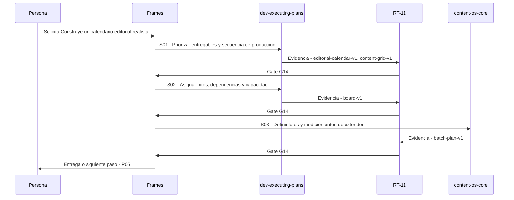

# P04 · Construye un calendario editorial realista

> Esta página se genera desde el workflow canónico. Para cambiarla, edita [su fuente](../../../02_proceso/workflows/multimedia/p04-calendarizar/workflow.yml) y regenera la documentación.

## Qué puedes conseguir

Ordena capacidad, dependencias y fechas desde investigación hasta aprendizaje.

## Cuándo usarlo

Frames selecciona este recorrido cuando el resultado solicitado corresponde a **Construye un calendario editorial realista**. Comando equivalente: `/calendarizar`.

## Qué necesita

- `p03-crear-brief/workflow.yml`

## Qué entrega

- `editorial-calendar-v1`
- `content-grid-v1`
- `board-v1`
- `batch-plan-v1`

## Cómo avanza

| Paso | Qué ocurre                                       | Skill principal       | Resultado                              | Aprobación |
| ---- | ------------------------------------------------ | --------------------- | -------------------------------------- | ---------- |
| S01  | Priorizar entregables y secuencia de producción. | `dev-executing-plans` | editorial-calendar-v1, content-grid-v1 | `G14`      |
| S02  | Asignar hitos, dependencias y capacidad.         | `dev-executing-plans` | board-v1                               | `G14`      |
| S03  | Definir lotes y medición antes de extender.      | `content-os-core`     | batch-plan-v1                          | `G14`      |

## Diagrama de secuencia

### Alternativa textual

1. La persona solicita Construye un calendario editorial realista.
2. S01: dev-executing-plans produce editorial-calendar-v1, content-grid-v1; RT-11 decide G14.
3. S02: dev-executing-plans produce board-v1; RT-11 decide G14.
4. S03: content-os-core produce batch-plan-v1; RT-11 decide G14.
5. Frames entrega el resultado y propone P05.

## Límites y detención

Si faltan briefs, crea un sprint mínimo con una pieza matriz y un derivado; si la capacidad es incierta, planifica la primera semana y mide antes de extender. interpreta, planifica, ejecuta.

Gates: `G14`. Solo una aprobación inequívoca permite avanzar.

## Siguiente paso

Si el resultado queda aprobado, Frames puede continuar con **P05**.
