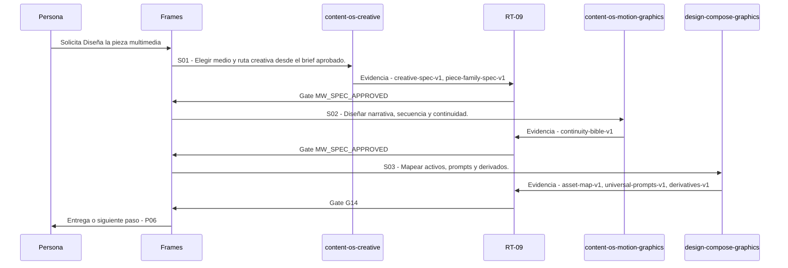

# P05 · Diseña la pieza multimedia

> Esta página se genera desde el workflow canónico. Para cambiarla, edita [su fuente](../../../02_proceso/workflows/multimedia/p05-disenar-pieza/workflow.yml) y regenera la documentación.

## Qué puedes conseguir

Convierte un brief aprobado en guion, secuencia, continuidad y mapa de activos.

## Cuándo usarlo

Frames selecciona este recorrido cuando el resultado solicitado corresponde a **Diseña la pieza multimedia**. Comando equivalente: `/disenar-pieza`.

## Qué necesita

- `p04-calendarizar/workflow.yml`

## Qué entrega

- `creative-spec-v1`
- `piece-family-spec-v1`
- `continuity-bible-v1`
- `asset-map-v1`
- `universal-prompts-v1`
- `derivatives-v1`

## Cómo avanza

| Paso | Qué ocurre                                            | Skill principal              | Resultado                                          | Aprobación         |
| ---- | ----------------------------------------------------- | ---------------------------- | -------------------------------------------------- | ------------------ |
| S01  | Elegir medio y ruta creativa desde el brief aprobado. | `content-os-creative`        | creative-spec-v1, piece-family-spec-v1             | `MW_SPEC_APPROVED` |
| S02  | Diseñar narrativa, secuencia y continuidad.           | `content-os-motion-graphics` | continuity-bible-v1                                | `MW_SPEC_APPROVED` |
| S03  | Mapear activos, prompts y derivados.                  | `design-compose-graphics`    | asset-map-v1, universal-prompts-v1, derivatives-v1 | `G14`              |

## Diagrama de secuencia

### Alternativa textual

1. La persona solicita Diseña la pieza multimedia.
2. S01: content-os-creative produce creative-spec-v1, piece-family-spec-v1; RT-09 decide MW_SPEC_APPROVED.
3. S02: content-os-motion-graphics produce continuity-bible-v1; RT-09 decide MW_SPEC_APPROVED.
4. S03: design-compose-graphics produce asset-map-v1, universal-prompts-v1, derivatives-v1; RT-09 decide G14.
5. Frames entrega el resultado y propone P06.

## Límites y detención

Si el brief no permite escoger medio o ruta, diseña un prototipo de bajo costo: una imagen o frame, un clip corto o una prueba de voz antes de comprometer la pieza completa. interpreta, planifica, ejecuta.

Gates: `MW_SPEC_APPROVED`, `G14`. Solo una aprobación inequívoca permite avanzar.

## Siguiente paso

Si el resultado queda aprobado, Frames puede continuar con **P06**.
