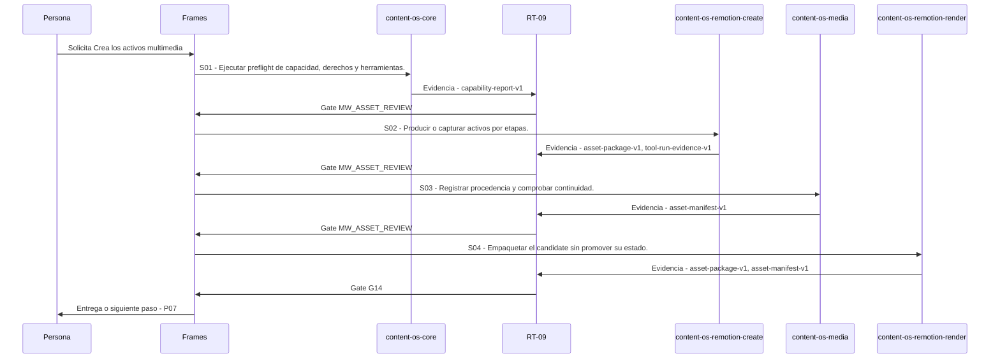

# P06 · Crea los activos multimedia

> Esta página se genera desde el workflow canónico. Para cambiarla, edita [su fuente](../../../02_proceso/workflows/multimedia/p06-crear-activos/workflow.yml) y regenera la documentación.

## Qué puedes conseguir

Genera, guía o especifica activos por etapas, con evidencia y estado exacto.

## Cuándo usarlo

Frames selecciona este recorrido cuando el resultado solicitado corresponde a **Crea los activos multimedia**. Comando equivalente: `/crear-activos`.

## Qué necesita

- `p05-disenar-pieza/workflow.yml`

## Qué entrega

- `asset-package-v1`
- `asset-manifest-v1`
- `capability-report-v1`
- `tool-run-evidence-v1`

## Cómo avanza

| Paso | Qué ocurre                                                | Skill principal              | Resultado                              | Aprobación        |
| ---- | --------------------------------------------------------- | ---------------------------- | -------------------------------------- | ----------------- |
| S01  | Ejecutar preflight de capacidad, derechos y herramientas. | `content-os-core`            | capability-report-v1                   | `MW_ASSET_REVIEW` |
| S02  | Producir o capturar activos por etapas.                   | `content-os-remotion-create` | asset-package-v1, tool-run-evidence-v1 | `MW_ASSET_REVIEW` |
| S03  | Registrar procedencia y comprobar continuidad.            | `content-os-media`           | asset-manifest-v1                      | `MW_ASSET_REVIEW` |
| S04  | Empaquetar el candidate sin promover su estado.           | `content-os-remotion-render` | asset-package-v1, asset-manifest-v1    | `G14`             |

## Diagrama de secuencia

### Alternativa textual

1. La persona solicita Crea los activos multimedia.
2. S01: content-os-core produce capability-report-v1; RT-09 decide MW_ASSET_REVIEW.
3. S02: content-os-remotion-create produce asset-package-v1, tool-run-evidence-v1; RT-09 decide MW_ASSET_REVIEW.
4. S03: content-os-media produce asset-manifest-v1; RT-09 decide MW_ASSET_REVIEW.
5. S04: content-os-remotion-render produce asset-package-v1, asset-manifest-v1; RT-09 decide G14.
6. Frames entrega el resultado y propone P07.

## Límites y detención

Si ninguna herramienta puede ejecutar, entrega prompts/instrucciones universales y orden de validación; si un riesgo de identidad, derechos o evidencia permanece abierto, produce solo prototipos no publicables o detén el activo afectado. interpreta, planifica, ejecuta.

Gates: `MW_ASSET_REVIEW`, `G14`. Solo una aprobación inequívoca permite avanzar.

## Siguiente paso

Si el resultado queda aprobado, Frames puede continuar con **P07**.
