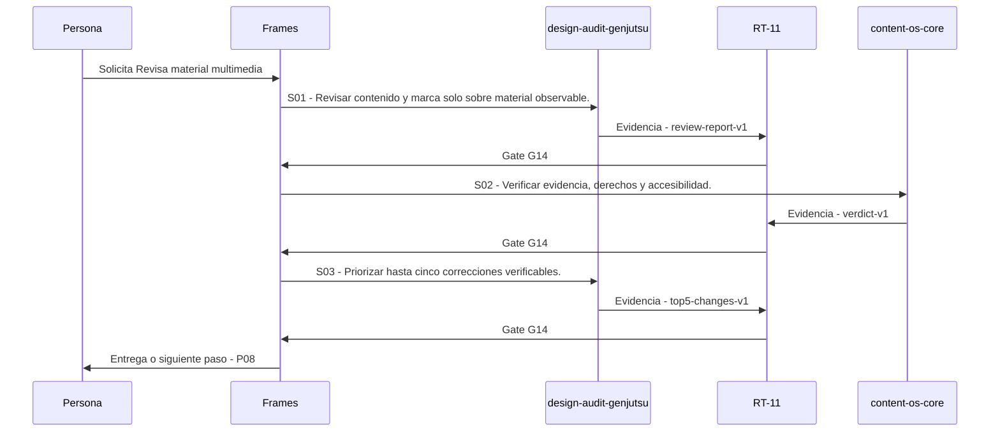

# P07 · Revisa material multimedia

> Esta página se genera desde el workflow canónico. Para cambiarla, edita [su fuente](../../../02_proceso/workflows/multimedia/p07-revisar/workflow.yml) y regenera la documentación.

## Qué puedes conseguir

Diagnostica solo lo observable y transforma hallazgos en correcciones priorizadas.

## Cuándo usarlo

Frames selecciona este recorrido cuando el resultado solicitado corresponde a **Revisa material multimedia**. Comando equivalente: `/revisar`.

## Qué necesita

- `p06-crear-activos/workflow.yml`

## Qué entrega

- `review-report-v1`
- `verdict-v1`
- `top5-changes-v1`

## Cómo avanza

| Paso | Qué ocurre                                                | Skill principal         | Resultado        | Aprobación |
| ---- | --------------------------------------------------------- | ----------------------- | ---------------- | ---------- |
| S01  | Revisar contenido y marca solo sobre material observable. | `design-audit-genjutsu` | review-report-v1 | `G14`      |
| S02  | Verificar evidencia, derechos y accesibilidad.            | `content-os-core`       | verdict-v1       | `G14`      |
| S03  | Priorizar hasta cinco correcciones verificables.          | `design-audit-genjutsu` | top5-changes-v1  | `G14`      |

## Diagrama de secuencia

### Alternativa textual

1. La persona solicita Revisa material multimedia.
2. S01: design-audit-genjutsu prepara review-report-v1; RT-11 verifica; RT-11 decide G14.
3. S02: content-os-core prepara verdict-v1; RT-11 verifica; RT-11 decide G14.
4. S03: design-audit-genjutsu prepara top5-changes-v1; RT-11 verifica; RT-11 decide G14.
5. Frames entrega el resultado y propone P08.

## Límites y detención

Si solo hay texto o frames, limita la revisión a eso y entrega checklist para la revisión completa; si el material no abre, solicita una copia o descripción sin inventar. interpreta, planifica, ejecuta.

Gates: `G14`. Solo una aprobación inequívoca permite avanzar.

## Siguiente paso

Si el resultado queda aprobado, Frames puede continuar con **P08**.
