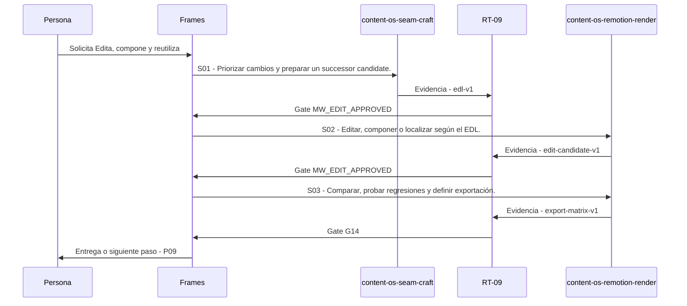

# P08 · Edita, compone y reutiliza

> Esta página se genera desde el workflow canónico. Para cambiarla, edita [su fuente](../../../02_proceso/workflows/multimedia/p08-editar/workflow.yml) y regenera la documentación.

## Qué puedes conseguir

Monta, compone, localiza y reutiliza con lineage, QC y rollback.

## Cuándo usarlo

Frames selecciona este recorrido cuando el resultado solicitado corresponde a **Edita, compone y reutiliza**. Comando equivalente: `/editar`.

## Qué necesita

- `p07-revisar/workflow.yml`

## Qué entrega

- `edit-candidate-v1`
- `edl-v1`
- `export-matrix-v1`

## Cómo avanza

| Paso | Qué ocurre                                           | Skill principal              | Resultado         | Aprobación         |
| ---- | ---------------------------------------------------- | ---------------------------- | ----------------- | ------------------ |
| S01  | Priorizar cambios y preparar un successor candidate. | `content-os-seam-craft`      | edl-v1            | `MW_EDIT_APPROVED` |
| S02  | Editar, componer o localizar según el EDL.           | `content-os-remotion-render` | edit-candidate-v1 | `MW_EDIT_APPROVED` |
| S03  | Comparar, probar regresiones y definir exportación.  | `content-os-remotion-render` | export-matrix-v1  | `G14`              |

## Diagrama de secuencia

### Alternativa textual

1. La persona solicita Edita, compone y reutiliza.
2. S01: content-os-seam-craft produce edl-v1; RT-09 decide MW_EDIT_APPROVED.
3. S02: content-os-remotion-render produce edit-candidate-v1; RT-09 decide MW_EDIT_APPROVED.
4. S03: content-os-remotion-render produce export-matrix-v1; RT-09 decide G14.
5. Frames entrega el resultado y propone P09.

## Límites y detención

Sin herramientas, entrega EDL y handoff completo; si el material no alcanza, crea un corte mínimo o vuelve a P06 para un activo de rescate. interpreta, planifica, ejecuta.

Gates: `MW_EDIT_APPROVED`, `G14`. Solo una aprobación inequívoca permite avanzar.

## Siguiente paso

Si el resultado queda aprobado, Frames puede continuar con **P09**.
