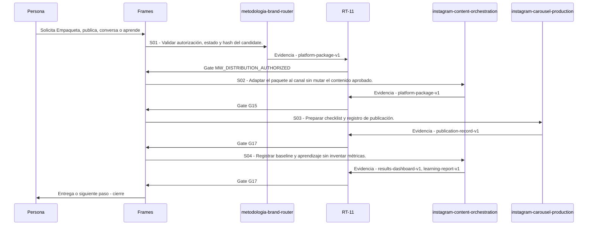

# P09 · Empaqueta, publica, conversa o aprende

> Esta página se genera desde el workflow canónico. Para cambiarla, edita [su fuente](../../../02_proceso/workflows/multimedia/p09-distribuir/workflow.yml) y regenera la documentación.

## Qué puedes conseguir

Separa empaque, publicación, comunidad y aprendizaje para operar con control.

## Cuándo usarlo

Frames selecciona este recorrido cuando el resultado solicitado corresponde a **Empaqueta, publica, conversa o aprende**. Comando equivalente: `/distribuir`.

## Qué necesita

- `p08-editar/workflow.yml`

## Qué entrega

- `platform-package-v1`
- `publication-record-v1`
- `results-dashboard-v1`
- `learning-report-v1`

## Cómo avanza

| Paso | Qué ocurre                                                   | Skill principal                   | Resultado                                | Aprobación                   |
| ---- | ------------------------------------------------------------ | --------------------------------- | ---------------------------------------- | ---------------------------- |
| S01  | Validar autorización, estado y hash del candidate.           | `metodologia-brand-router`        | platform-package-v1                      | `MW_DISTRIBUTION_AUTHORIZED` |
| S02  | Adaptar el paquete al canal sin mutar el contenido aprobado. | `instagram-content-orchestration` | platform-package-v1                      | `G15`                        |
| S03  | Preparar checklist y registro de publicación.                | `instagram-carousel-production`   | publication-record-v1                    | `G17`                        |
| S04  | Registrar baseline y aprendizaje sin inventar métricas.      | `instagram-content-orchestration` | results-dashboard-v1, learning-report-v1 | `G17`                        |

## Diagrama de secuencia

### Alternativa textual

1. La persona solicita Empaqueta, publica, conversa o aprende.
2. S01: metodologia-brand-router prepara platform-package-v1; RT-11 verifica; RT-11 decide MW_DISTRIBUTION_AUTHORIZED.
3. S02: instagram-content-orchestration prepara platform-package-v1; RT-11 verifica; RT-11 decide G15.
4. S03: instagram-carousel-production prepara publication-record-v1; RT-11 verifica; RT-11 decide G17.
5. S04: instagram-content-orchestration prepara results-dashboard-v1, learning-report-v1; RT-11 verifica; RT-11 decide G17.
6. Frames entrega el resultado y cierra el recorrido.

## Límites y detención

Sin navegación, crea package evergreen; sin herramienta, checklist manual; sin aprobación, detente; sin datos, establece baseline cualitativo; ante riesgo, escala. interpreta, planifica, ejecuta.

Gates: `MW_DISTRIBUTION_AUTHORIZED`, `G15`, `G17`. Solo una aprobación inequívoca permite avanzar.

## Siguiente paso

Este workflow cierra su familia. Cualquier efecto externo requiere una autorización separada.
