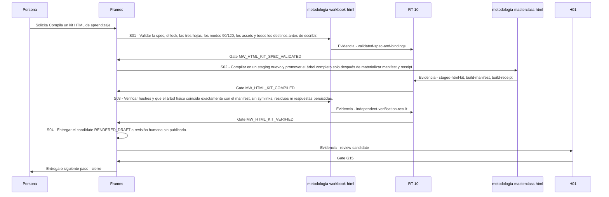

# P90 · Compila un kit HTML de aprendizaje

> Esta página se genera desde el workflow canónico. Para cambiarla, edita [su fuente](../../../02_proceso/workflows/content/html-learning-kit/workflow.yml) y regenera la documentación.

## Qué puedes conseguir

Compilar y verificar una landing, un workbook y una masterclass trilingües desde una spec hash-bound, sin persistir respuestas ni conceder autoridad de publicación.

## Cuándo usarlo

Frames selecciona este recorrido cuando el resultado solicitado corresponde a **Compila un kit HTML de aprendizaje**. Comando equivalente: `/html-learning-kit`.

## Qué necesita

- `html-learning-kit-spec-v1`
- `design-system-lock-ref-and-sha256`
- `brand-authority-ref-and-sha256`
- `localized-content-es-en-pt`
- `asset-rights-and-sha256`

## Qué entrega

- `landing-html-es-en-pt`
- `workbook-html-es-en-pt`
- `masterclass-html-es-en-pt`
- `html-learning-kit-build-manifest-v1`
- `html-learning-kit-build-receipt-v1`

## Cómo avanza

| Paso | Qué ocurre                                                                                                                     | Skill principal                | Resultado                                      | Aprobación                   |
| ---- | ------------------------------------------------------------------------------------------------------------------------------ | ------------------------------ | ---------------------------------------------- | ---------------------------- |
| S01  | Validar la spec, el lock, las tres hojas, los modos 90/120, los assets y todos los destinos antes de escribir.                 | `metodologia-workbook-html`    | validated-spec-and-bindings                    | `MW_HTML_KIT_SPEC_VALIDATED` |
| S02  | Compilar en un staging nuevo y promover el árbol completo solo después de materializar manifest y receipt.                     | `metodologia-masterclass-html` | staged-html-kit, build-manifest, build-receipt | `MW_HTML_KIT_COMPILED`       |
| S03  | Verificar hashes y que el árbol físico coincida exactamente con el manifest, sin symlinks, residuos ni respuestas persistidas. | `metodologia-workbook-html`    | independent-verification-result                | `MW_HTML_KIT_VERIFIED`       |
| S04  | Entregar el candidate RENDERED_DRAFT a revisión humana sin publicarlo.                                                         | `Frames`                       | review-candidate                               | `G15`                        |

## Diagrama de secuencia

### Alternativa textual

1. La persona solicita Compila un kit HTML de aprendizaje.
2. S01: metodologia-workbook-html produce validated-spec-and-bindings; RT-10 decide MW_HTML_KIT_SPEC_VALIDATED.
3. S02: metodologia-masterclass-html produce staged-html-kit, build-manifest, build-receipt; RT-10 decide MW_HTML_KIT_COMPILED.
4. S03: metodologia-workbook-html produce independent-verification-result; RT-10 decide MW_HTML_KIT_VERIFIED.
5. S04: Frames produce review-candidate; H01 decide G15.
6. Frames entrega el resultado y cierra el recorrido.

## Límites y detención

Detener antes de escribir ante spec, lock, derechos, hashes, deep links o paths inválidos; detener antes de revisión ante outputs ausentes, modificados, residuales o con persistencia de respuestas.

Gates: `MW_HTML_KIT_SPEC_VALIDATED`, `MW_HTML_KIT_COMPILED`, `MW_HTML_KIT_VERIFIED`, `G15`. Solo una aprobación inequívoca permite avanzar.

## Siguiente paso

Este workflow cierra su familia. Cualquier efecto externo requiere una autorización separada.
