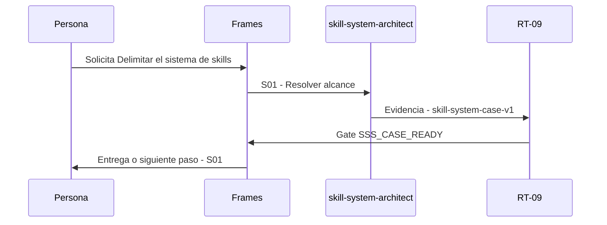

# S00 · Delimitar el sistema de skills

> Esta página se genera desde el workflow canónico. Para cambiarla, edita [su fuente](../../../02_proceso/workflows/skill-systems/s00-intake/workflow.yml) y regenera la documentación.

## Qué puedes conseguir

Convertir una petición cotidiana en un Skill Case ligado a evidencia, alcance y autoridad.

## Cuándo usarlo

Frames selecciona este recorrido cuando el resultado solicitado corresponde a **Delimitar el sistema de skills**. Comando equivalente: `No disponible`.

## Qué necesita

- `request`
- `scope`
- `source-refs`

## Qué entrega

- `skill-system-case-v1`

## Cómo avanza

| Paso | Qué ocurre       | Skill principal          | Resultado            | Aprobación       |
| ---- | ---------------- | ------------------------ | -------------------- | ---------------- |
| S01  | Resolver alcance | `skill-system-architect` | skill-system-case-v1 | `SSS_CASE_READY` |

## Diagrama de secuencia

### Alternativa textual

1. La persona solicita Delimitar el sistema de skills.
2. S01: skill-system-architect prepara skill-system-case-v1; RT-09 verifica; RT-09 decide SSS_CASE_READY.
3. Frames entrega el resultado y propone S01.

## Límites y detención

No diseñar topología sin Skill Case resoluble.

Gates: `SSS_CASE_READY`. Solo una aprobación inequívoca permite avanzar.

## Siguiente paso

Si el resultado queda aprobado, Frames puede continuar con **S01**.
