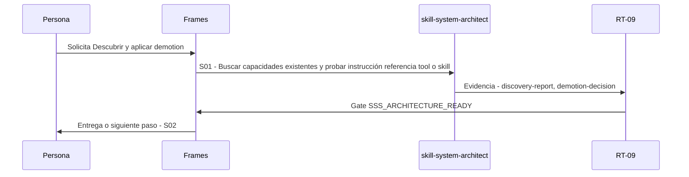

# S01 · Descubrir y aplicar demotion

> Esta página se genera desde el workflow canónico. Para cambiarla, edita [su fuente](../../../02_proceso/workflows/skill-systems/s01-discovery/workflow.yml) y regenera la documentación.

## Qué puedes conseguir

Comparar el pedido con el portfolio y elegir el componente suficiente más pequeño.

## Cuándo usarlo

Frames selecciona este recorrido cuando el resultado solicitado corresponde a **Descubrir y aplicar demotion**. Comando equivalente: `No disponible`.

## Qué necesita

- `skill-system-case-v1`
- `ecosystem-inventory`

## Qué entrega

- Ninguno declarado.

## Cómo avanza

| Paso | Qué ocurre                                                                 | Skill principal          | Resultado                           | Aprobación               |
| ---- | -------------------------------------------------------------------------- | ------------------------ | ----------------------------------- | ------------------------ |
| S01  | Buscar capacidades existentes y probar instrucción referencia tool o skill | `skill-system-architect` | discovery-report, demotion-decision | `SSS_ARCHITECTURE_READY` |

## Diagrama de secuencia

### Alternativa textual

1. La persona solicita Descubrir y aplicar demotion.
2. S01: skill-system-architect produce discovery-report, demotion-decision; RT-09 decide SSS_ARCHITECTURE_READY.
3. Frames entrega el resultado y propone S02.

## Límites y detención

Colisiones u owners desconocidos bloquean.

Gates: `SSS_ARCHITECTURE_READY`. Solo una aprobación inequívoca permite avanzar.

## Siguiente paso

Si el resultado queda aprobado, Frames puede continuar con **S02**.
