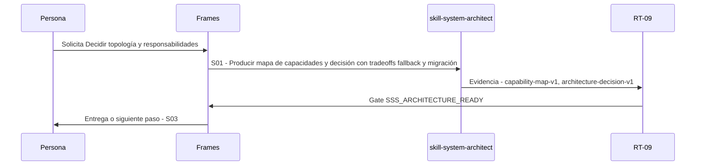

# S02 · Decidir topología y responsabilidades

> Esta página se genera desde el workflow canónico. Para cambiarla, edita [su fuente](../../../02_proceso/workflows/skill-systems/s02-architecture/workflow.yml) y regenera la documentación.

## Qué puedes conseguir

Separar skill tool referencia schema estado evaluator adapter y aprobación humana.

## Cuándo usarlo

Frames selecciona este recorrido cuando el resultado solicitado corresponde a **Decidir topología y responsabilidades**. Comando equivalente: `No disponible`.

## Qué necesita

- `skill-system-case-v1`
- `discovery-report`

## Qué entrega

- Ninguno declarado.

## Cómo avanza

| Paso | Qué ocurre                                                                 | Skill principal          | Resultado                                   | Aprobación               |
| ---- | -------------------------------------------------------------------------- | ------------------------ | ------------------------------------------- | ------------------------ |
| S01  | Producir mapa de capacidades y decisión con tradeoffs fallback y migración | `skill-system-architect` | capability-map-v1, architecture-decision-v1 | `SSS_ARCHITECTURE_READY` |

## Diagrama de secuencia

### Alternativa textual

1. La persona solicita Decidir topología y responsabilidades.
2. S01: skill-system-architect produce capability-map-v1, architecture-decision-v1; RT-09 decide SSS_ARCHITECTURE_READY.
3. Frames entrega el resultado y propone S03.

## Límites y detención

Un componente sin owner o efecto queda BLOCKED.

Gates: `SSS_ARCHITECTURE_READY`. Solo una aprobación inequívoca permite avanzar.

## Siguiente paso

Si el resultado queda aprobado, Frames puede continuar con **S03**.
