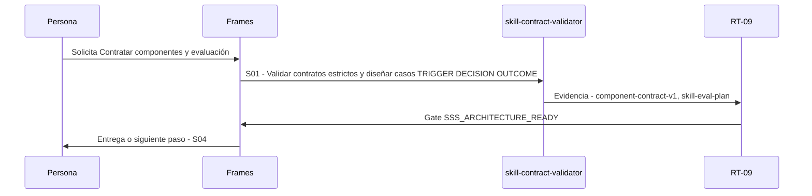

# S03 · Contratar componentes y evaluación

> Esta página se genera desde el workflow canónico. Para cambiarla, edita [su fuente](../../../02_proceso/workflows/skill-systems/s03-contract/workflow.yml) y regenera la documentación.

## Qué puedes conseguir

Fijar inputs outputs efectos fallback aceptación y baseline antes de autoría.

## Cuándo usarlo

Frames selecciona este recorrido cuando el resultado solicitado corresponde a **Contratar componentes y evaluación**. Comando equivalente: `No disponible`.

## Qué necesita

- `capability-map-v1`
- `architecture-decision-v1`

## Qué entrega

- Ninguno declarado.

## Cómo avanza

| Paso | Qué ocurre                                                           | Skill principal            | Resultado                              | Aprobación               |
| ---- | -------------------------------------------------------------------- | -------------------------- | -------------------------------------- | ------------------------ |
| S01  | Validar contratos estrictos y diseñar casos TRIGGER DECISION OUTCOME | `skill-contract-validator` | component-contract-v1, skill-eval-plan | `SSS_ARCHITECTURE_READY` |

## Diagrama de secuencia

### Alternativa textual

1. La persona solicita Contratar componentes y evaluación.
2. S01: skill-contract-validator produce component-contract-v1, skill-eval-plan; RT-09 decide SSS_ARCHITECTURE_READY.
3. Frames entrega el resultado y propone S04.

## Límites y detención

No autorizar candidate con contratos incompletos.

Gates: `SSS_ARCHITECTURE_READY`. Solo una aprobación inequívoca permite avanzar.

## Siguiente paso

Si el resultado queda aprobado, Frames puede continuar con **S04**.
