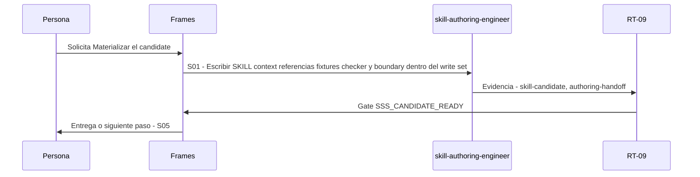

# S04 · Materializar el candidate

> Esta página se genera desde el workflow canónico. Para cambiarla, edita [su fuente](../../../02_proceso/workflows/skill-systems/s04-author/workflow.yml) y regenera la documentación.

## Qué puedes conseguir

Crear el paquete aprobado mediante adapter autorizado y progressive disclosure.

## Cuándo usarlo

Frames selecciona este recorrido cuando el resultado solicitado corresponde a **Materializar el candidate**. Comando equivalente: `No disponible`.

## Qué necesita

- `component-contract-v1`
- `skill-eval-plan`
- `work-order`

## Qué entrega

- `skill-candidate`
- `authoring-handoff`

## Cómo avanza

| Paso | Qué ocurre                                                                          | Skill principal            | Resultado                          | Aprobación            |
| ---- | ----------------------------------------------------------------------------------- | -------------------------- | ---------------------------------- | --------------------- |
| S01  | Escribir SKILL context referencias fixtures checker y boundary dentro del write set | `skill-authoring-engineer` | skill-candidate, authoring-handoff | `SSS_CANDIDATE_READY` |

## Diagrama de secuencia

### Alternativa textual

1. La persona solicita Materializar el candidate.
2. S01: skill-authoring-engineer prepara skill-candidate, authoring-handoff; RT-09 verifica; RT-09 decide SSS_CANDIDATE_READY.
3. Frames entrega el resultado y propone S05.

## Límites y detención

Un adapter externo ausente degrada a handoff o UNKNOWN.

Gates: `SSS_CANDIDATE_READY`. Solo una aprobación inequívoca permite avanzar.

## Siguiente paso

Si el resultado queda aprobado, Frames puede continuar con **S05**.
