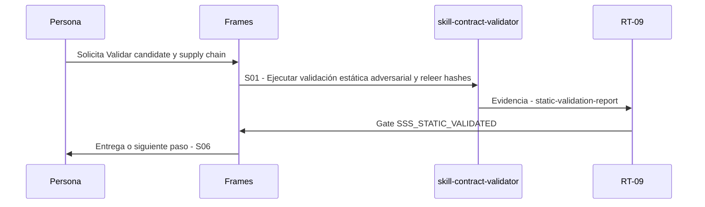

# S05 · Validar candidate y supply chain

> Esta página se genera desde el workflow canónico. Para cambiarla, edita [su fuente](../../../02_proceso/workflows/skill-systems/s05-validate/workflow.yml) y regenera la documentación.

## Qué puedes conseguir

Verificar estructura referencias paths hashes efectos fixtures y dependencias.

## Cuándo usarlo

Frames selecciona este recorrido cuando el resultado solicitado corresponde a **Validar candidate y supply chain**. Comando equivalente: `No disponible`.

## Qué necesita

- `skill-candidate`
- `component-contract-v1`

## Qué entrega

- `static-validation-report`

## Cómo avanza

| Paso | Qué ocurre                                               | Skill principal            | Resultado                | Aprobación             |
| ---- | -------------------------------------------------------- | -------------------------- | ------------------------ | ---------------------- |
| S01  | Ejecutar validación estática adversarial y releer hashes | `skill-contract-validator` | static-validation-report | `SSS_STATIC_VALIDATED` |

## Diagrama de secuencia

### Alternativa textual

1. La persona solicita Validar candidate y supply chain.
2. S01: skill-contract-validator prepara static-validation-report; RT-09 verifica; RT-09 decide SSS_STATIC_VALIDATED.
3. Frames entrega el resultado y propone S06.

## Límites y detención

E3 sin sandbox material queda VALIDATED_NOT_RUNNABLE.

Gates: `SSS_STATIC_VALIDATED`. Solo una aprobación inequívoca permite avanzar.

## Siguiente paso

Si el resultado queda aprobado, Frames puede continuar con **S06**.
