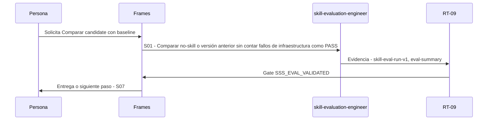

# S06 · Comparar candidate con baseline

> Esta página se genera desde el workflow canónico. Para cambiarla, edita [su fuente](../../../02_proceso/workflows/skill-systems/s06-evaluate/workflow.yml) y regenera la documentación.

## Qué puedes conseguir

Ejecutar casos realistas y assertions observables con replay determinista.

## Cuándo usarlo

Frames selecciona este recorrido cuando el resultado solicitado corresponde a **Comparar candidate con baseline**. Comando equivalente: `No disponible`.

## Qué necesita

- `skill-candidate`
- `skill-eval-plan`
- `static-validation-report`

## Qué entrega

- `skill-eval-run-v1`
- `eval-summary`

## Cómo avanza

| Paso | Qué ocurre                                                                          | Skill principal             | Resultado                       | Aprobación           |
| ---- | ----------------------------------------------------------------------------------- | --------------------------- | ------------------------------- | -------------------- |
| S01  | Comparar no-skill o versión anterior sin contar fallos de infraestructura como PASS | `skill-evaluation-engineer` | skill-eval-run-v1, eval-summary | `SSS_EVAL_VALIDATED` |

## Diagrama de secuencia

### Alternativa textual

1. La persona solicita Comparar candidate con baseline.
2. S01: skill-evaluation-engineer prepara skill-eval-run-v1, eval-summary; RT-09 verifica; RT-09 decide SSS_EVAL_VALIDATED.
3. Frames entrega el resultado y propone S07.

## Límites y detención

Candidate no avanza si no mejora baseline en casos declarados.

Gates: `SSS_EVAL_VALIDATED`. Solo una aprobación inequívoca permite avanzar.

## Siguiente paso

Si el resultado queda aprobado, Frames puede continuar con **S07**.
