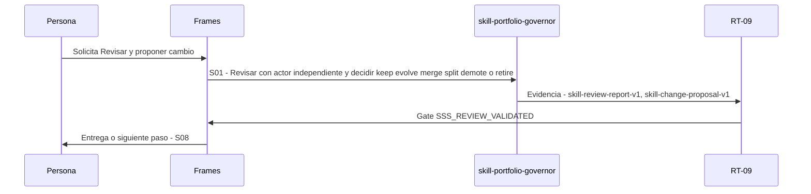

# S07 · Revisar y proponer cambio

> Esta página se genera desde el workflow canónico. Para cambiarla, edita [su fuente](../../../02_proceso/workflows/skill-systems/s07-review/workflow.yml) y regenera la documentación.

## Qué puedes conseguir

Atribuir fallos al componente dueño y emitir una propuesta sin automutación.

## Cuándo usarlo

Frames selecciona este recorrido cuando el resultado solicitado corresponde a **Revisar y proponer cambio**. Comando equivalente: `No disponible`.

## Qué necesita

- `skill-candidate`
- `skill-eval-run-v1`

## Qué entrega

- Ninguno declarado.

## Cómo avanza

| Paso | Qué ocurre                                                                        | Skill principal            | Resultado                                        | Aprobación             |
| ---- | --------------------------------------------------------------------------------- | -------------------------- | ------------------------------------------------ | ---------------------- |
| S01  | Revisar con actor independiente y decidir keep evolve merge split demote o retire | `skill-portfolio-governor` | skill-review-report-v1, skill-change-proposal-v1 | `SSS_REVIEW_VALIDATED` |

## Diagrama de secuencia

### Alternativa textual

1. La persona solicita Revisar y proponer cambio.
2. S01: skill-portfolio-governor produce skill-review-report-v1, skill-change-proposal-v1; RT-09 decide SSS_REVIEW_VALIDATED.
3. Frames entrega el resultado y propone S08.

## Límites y detención

Una propuesta no muta el candidate.

Gates: `SSS_REVIEW_VALIDATED`. Solo una aprobación inequívoca permite avanzar.

## Siguiente paso

Si el resultado queda aprobado, Frames puede continuar con **S08**.
