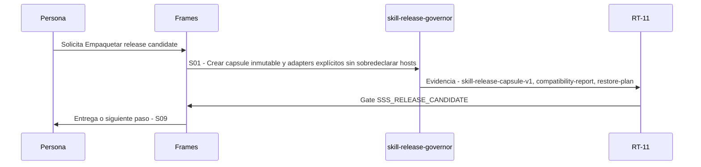

# S08 · Empaquetar release candidate

> Esta página se genera desde el workflow canónico. Para cambiarla, edita [su fuente](../../../02_proceso/workflows/skill-systems/s08-package/workflow.yml) y regenera la documentación.

## Qué puedes conseguir

Congelar archivos hashes compatibilidad gaps y restauración sin sobreescritura.

## Cuándo usarlo

Frames selecciona este recorrido cuando el resultado solicitado corresponde a **Empaquetar release candidate**. Comando equivalente: `No disponible`.

## Qué necesita

- `skill-candidate`
- `skill-review-report-v1`
- `skill-change-proposal-v1`

## Qué entrega

- `skill-release-capsule-v1`
- `compatibility-report`
- `restore-plan`

## Cómo avanza

| Paso | Qué ocurre                                                            | Skill principal          | Resultado                                                    | Aprobación              |
| ---- | --------------------------------------------------------------------- | ------------------------ | ------------------------------------------------------------ | ----------------------- |
| S01  | Crear capsule inmutable y adapters explícitos sin sobredeclarar hosts | `skill-release-governor` | skill-release-capsule-v1, compatibility-report, restore-plan | `SSS_RELEASE_CANDIDATE` |

## Diagrama de secuencia

### Alternativa textual

1. La persona solicita Empaquetar release candidate.
2. S01: skill-release-governor prepara skill-release-capsule-v1, compatibility-report, restore-plan; RT-11 verifica; RT-11 decide SSS_RELEASE_CANDIDATE.
3. Frames entrega el resultado y propone S09.

## Límites y detención

Capsule existente no se sobrescribe.

Gates: `SSS_RELEASE_CANDIDATE`. Solo una aprobación inequívoca permite avanzar.

## Siguiente paso

Si el resultado queda aprobado, Frames puede continuar con **S09**.
