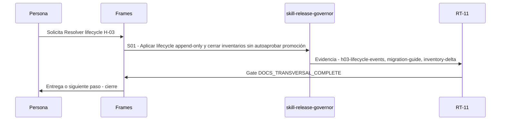

# S09 · Resolver lifecycle H-03

> Esta página se genera desde el workflow canónico. Para cambiarla, edita [su fuente](../../../02_proceso/workflows/skill-systems/s09-lifecycle/workflow.yml) y regenera la documentación.

## Qué puedes conseguir

Versionar superseder retirar o preparar promoción con lineage y documentación sincronizados.

## Cuándo usarlo

Frames selecciona este recorrido cuando el resultado solicitado corresponde a **Resolver lifecycle H-03**. Comando equivalente: `No disponible`.

## Qué necesita

- `skill-release-capsule-v1`
- `documentation-closure-receipt-v1`

## Qué entrega

- `h03-lifecycle-events`
- `migration-guide`
- `inventory-delta`

## Cómo avanza

| Paso | Qué ocurre                                                                   | Skill principal          | Resultado                                              | Aprobación                  |
| ---- | ---------------------------------------------------------------------------- | ------------------------ | ------------------------------------------------------ | --------------------------- |
| S01  | Aplicar lifecycle append-only y cerrar inventarios sin autoaprobar promoción | `skill-release-governor` | h03-lifecycle-events, migration-guide, inventory-delta | `DOCS_TRANSVERSAL_COMPLETE` |

## Diagrama de secuencia

### Alternativa textual

1. La persona solicita Resolver lifecycle H-03.
2. S01: skill-release-governor prepara h03-lifecycle-events, migration-guide, inventory-delta; RT-11 verifica; RT-11 decide DOCS_TRANSVERSAL_COMPLETE.
3. Frames entrega el resultado y cierra el recorrido.

## Límites y detención

Estado máximo active/local-evaluation hasta H01 específico.

Gates: `DOCS_TRANSVERSAL_COMPLETE`. Solo una aprobación inequívoca permite avanzar.

## Siguiente paso

Este workflow cierra su familia. Cualquier efecto externo requiere una autorización separada.
