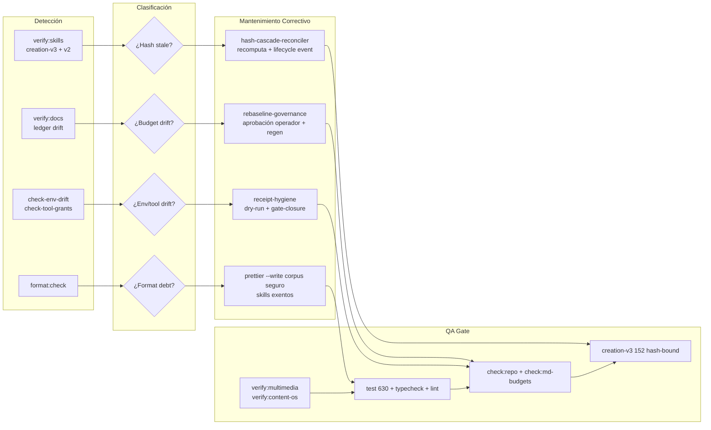
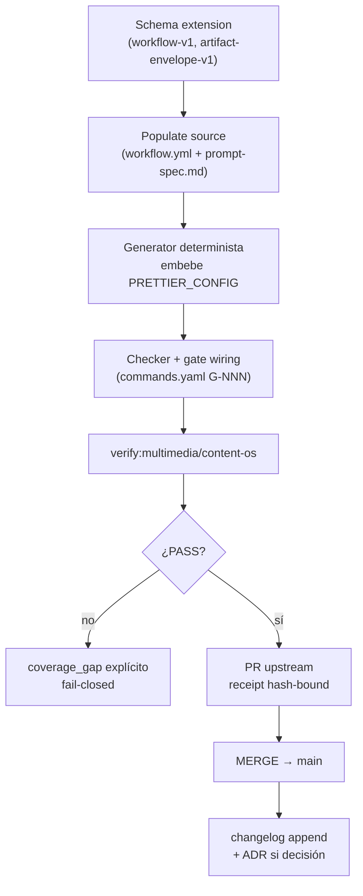
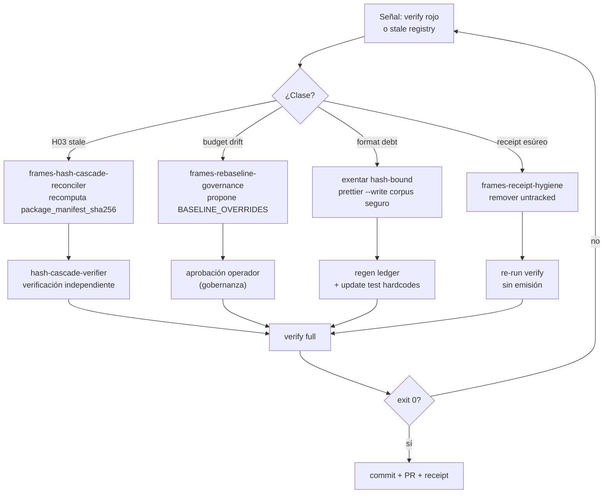
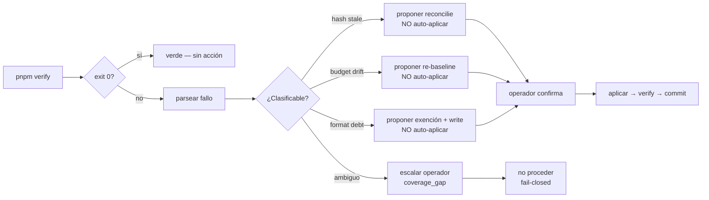
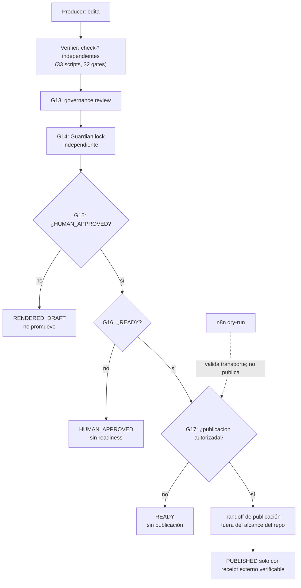
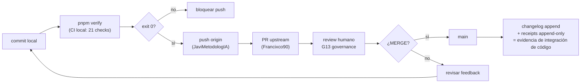

# Lecciones Aprendidas — Meta-Gestión de Frames-Agent-OS

Registro append-only, oldest-first, blameless y accionable. Cada entrada nueva se agrega inmediatamente antes del marcador final. Fuente: patrón `dev-retro` + commits de PR #98-#100 (lift atemporal, multimedia P00-P09 y format-debt). Identidad: MetodologIA. `[CONFIG]`

Cada entrada: **Recuento → Lecciones → Propuestas (skills/agents/workflows) → Flujos**. Las propuestas son `[INFERENCIA]`/`[SUPUESTO]` (no existen hasta homologación H-03); lo existente lleva `[CÓDIGO]`/`[CONFIG]`/`[DOC]`.

---

## Retro de PR #98-#100 — Lift atemporal + multimedia P00-P09 + deuda de formato

### Recuento del proceso

Sesión multi-PR sobre `feat/workflows-bluf-visual` (base `main` @ `4404816`). Trabajo en dos oleadas:

**Oleada 1 — Workflows deterministas + BLUF + visual + HTML WOW (PR-A, merged parcial)**

- Extensión de schema `multimedia-workflow-v1` con `capability_map` + `brief` (BLUF). `[CÓDIGO]`
- Populate de 10 `workflow.yml` (P00-P09) con bindings reales contra `creation-v3-skill-registry.yml`, `skill-registry.yml` (v2), `03_artefactos/skills/vendor/*`, `_assets/artifact-registry.md`. `[CÓDIGO]`
- 10 `prompt-spec.md` reestructurados outputs-first (sin etiqueta "BLUF"). 10 mermaid embebidos + `chain-schematic.md` (cadena P00→P09 + gates MW_*). `[DOC]`
- Generador `scaffold-artifact-schemas.ts` → 33 envelope schemas + base + index (determinista, hash `55ff601f...`). `[CÓDIGO]`
- Template `schematic-template.html` + render `render-schematic-html.ts` → 10 `schematic.html` brand-ready (tokens `social-light.css`, SVG chain, GSAP local). Estado `RENDERED_DRAFT`. `[CÓDIGO]`
- Checker `check-multimedia-capabilities.ts` (MW-CAP-04 real file-binding). `[CÓDIGO]`
- 8 `content-os-*/rules/workflow-contract.md` con BLUF + mermaid. `[DOC]`
- README full system update (152 v3 + 10 v2 = 162, 25 vendor dirs, gates G00-G21 + MW_*). `[DOC]`

**Oleada 2 — Cierre de deudas de verificación (PR #99 + PR #100)**

- `14d3385` + `5a9b6e6` (PR #99, MERGED `e6320ec`): 33 artifact envelope schemas + generator + commands.test (32 gates) + lint render-schematic.
- `63d6e59`: colapso lifecycle `remotion-video-production` 6→5 events (dos active→active violaban contrato creation-v3). Renumerado con `supersedes_event_id`. `[CÓDIGO]`
- `c89d13d`: re-baseline dirigido README+AGENTS vía `BASELINE_OVERRIDES` (per-file, 2x cap vs override commit). Gobernanza: aprobado por operador. `[CONFIG]`
- `d9c5310`: resolución deuda format:check 228 archivos SIN romper H03 (exentar `03_artefactos/skills/**` + `env-manifest` de `.prettierignore`; `prettier --write` sobre corpus seguro 176 archivos). Regen ledger (rolling-baseline shift 92713→92786, 34882→34911). `[CONFIG]`

**Estado terminal:** `pnpm verify` exit 0 — 630/630 tests, format:check green, creation-v3 (152 hash-bound), multimedia (10 stages), v2 PASS, typecheck+lint clean, check:repo PASS. `package.json` sha `8fb1c4f6` invariante → sin cascada de receipts. `[CÓDIGO]`

### Lecciones aprendidas (blameless, accionables)

**L1 — Prettier blanket rompe H03.** `prettier --write .` reformatea dirs de skills hash-bound → `package_manifest_sha256` deriva → `SKL-H03-005 stale` + 4 regresiones de test. El lock H03 es la autoridad del contenido de un skill, no el estilo. **Acción:** exentar `03_artefactos/skills/**` del blanket format (hecho en `d9c5310`). [CÓDIGO]

**L2 — Re-baseline es decisión de gobernanza, no mecánica.** README 2.34x, AGENTS 2.11x. Re-baselinear sin aprobación viola fail-closed (una ausencia no se sustituye por inferencia pulida). **Acción:** `BASELINE_OVERRIDES` requiere aprobación explícita del operador + documentar commit de origen + rationale. [CONFIG]

**L3 — Rolling baseline absorbe ruido de formato.** `v3ImpactedAdjustment` lee `current.words` del árbol de trabajo. Prettier reformateó markdown canónico V2 → +73 words → baseline_words 92713→92786. El mecanismo no distingue causa (V3-work vs format-noise). **Acción:** tras cualquier reformateo de corpus, regenerar ledger + actualizar hardcodes de test ANTES de commit; no perseguir el drift como violación. [CÓDIGO]

**L4 — Checks que emiten receipts no son diagnósticos.** `check-env-drift`/`check-tool-grants` escriben receipts append-only (`04_estado/receipts/check-runs/C-NNN/`). Correrlos como diagnóstico emite evidence esúrea sin gate cerrado. **Acción:** separar `--dry-run` (sin escritura) de emisión de receipt; nunca correr gate-emitting checks como sondeo fuera de `pnpm verify`. [CONFIG]

**L5 — Stash dance requiere verificación de branch.** Stash hecho en `feat/workflows-bluf-visual`, checkout a `feat/atemporal-simplicity-lift`, pop → conflictos UU/DU. `git reset --hard` denegado (destrucción local irreversible). **Acción:** `git branch --show-current` antes de stash; pop en la branch de origen. [INFERENCIA]

**L6 — Generador determinista debe embeber config de estilo.** `prettier.resolveConfig` devolvió null (cwd equivocado) → output con spacing default → no determinismo. **Acción:** el generador embebe `PRETTIER_CONFIG` literal espejo de `.prettierrc.json`. [CÓDIGO]

**L7 — Título de PR debe matches contenido de commits.** PR #100 titulado "format:check debt" contenía 3 commits (2 `fix:` stranded + 1 `chore:`). Commits stranded cuando PR #99 mergeó antes de que aterrizaran. **Acción:** al abrir PR, el título cubre el set completo de commits; si merge parcial deja stranded, PR nuevo con título que abarque todos. [CONFIG]

**L8 — Producer/verifier/Guardian distintos.** El que edita un skill dir no puede validar su propio `package_manifest_sha256`. El Guardian corre `check-creation-v3-skills`/`check-instagram-v2-skills` independiente. **Acción:** nunca auto-verificar la cascada que uno mismo produjo. [CONFIG]

### Propuestas — Skills, Agents, Workflows para meta-gestionar frames

> `[INFERENCIA]`/`[SUPUESTO]`: no existen hasta homologación H-03 (creation-v3 o v2 lifecycle). Propuestas para discusión del comité.

#### Skills (determinismo + confiabilidad)

| Skill propuesto                        | Problema que cierra                                                                                                                                    | Origen |
| -------------------------------------- | ------------------------------------------------------------------------------------------------------------------------------------------------------ | ------ |
| `frames-hash-cascade-reconciler`       | Detecta `package_manifest_sha256` stale tras edit de skill-dir; recomputa + propone evento lifecycle + actualiza current-view del registry. Cierre L1. | L1, L8 |
| `frames-rebaseline-governance`         | Orquesta re-baseline aprobado: `BASELINE_OVERRIDES` + regen ledger + update hardcodes de test + receipt de gobernanza. Cierre L2/L3.                   | L2, L3 |
| `frames-receipt-hygiene`               | Clasifica gate-closure vs diagnóstico; bloquea emisión esúrea de receipts; modo `--dry-run` para sondeo. Cierre L4.                                    | L4     |
| `frames-pr-coherence`                  | Valida título/body de PR contra set real de commits; detecta stranded commits tras merge parcial. Cierre L7.                                           | L7     |
| `frames-deterministic-generator-audit` | Verifica que todo generador embeba config de estilo + produzca output byte-estable en re-run. Cierre L6.                                               | L6     |

#### Agents (meta-gestión permanente)

| Agent propuesto         | Rol                                                                                                                                                                                   | Activación                                                     |
| ----------------------- | ------------------------------------------------------------------------------------------------------------------------------------------------------------------------------------- | -------------------------------------------------------------- |
| `meta-guardian-frames`  | Triad miembro permanente para meta-gestión: vigila sucesión de locks H03, caps de budget, coherencia format-gate, receipts append-only. No produce contenido; solo orquesta + escala. | Todas las fases (como `quality-guardian` pero con foco frames) |
| `frames-steward`        | Operator-facing: propone maintenance evolutivo/correctivo, prioriza coverage_gaps, prepara re-baseline proposals para aprobación.                                                     | Sesiones de mantenimiento                                      |
| `hash-cascade-verifier` | Verificador independiente de `frames-hash-cascade-reconciler` (separación producer/verifier).                                                                                         | Post-edición de skill dirs                                     |

#### Workflows (flujos de mantenimiento)

Ver sección **Flujos** abajo.

### Flujos de mantenimiento

#### Mantenimiento evolutivo (nueva capability)

- **Trigger:** nueva capability map, nuevo artifact, nuevo stage.
- **Skills:** `frames-deterministic-generator-audit` (L6), `dev-writing-skills` (H-03 lifecycle).
- **Gate:** `verify:multimedia` + `verify:content-os` + `verify:skills` (determinismo: capability_map resuelve, BLUF non-empty, assets existen).
- **Receipt:** check-run append-only (`04_estado/receipts/check-runs/C-NNN/`), `RENDERED_DRAFT != HUMAN_APPROVED`.

#### Mantenimiento correctivo (regresión/drift)

- **Trigger:** `SKL-H03-005 stale`, `validateDocs` errors, `format:check` red, env-drift mismatch.
- **Principio:** escalada > asunción. Re-baseline requiere aprobación. Producer ≠ verifier. [CONFIG]
- **Anti-patrón:** bump mecánico de hardcodes sin documentar shift (L3); correr gate-emitting checks como sondeo (L4).

#### Auto-QA (self-heal bajo confirmación)

- **Principio:** auto-QA **propone**, no **aplica**. Toda mutación de hash/baseline/receipt requiere confirmación del operador. [CONFIG]
- **Límite:** máx 2 re-runs por fase con feedback específico; 2do fallo → escalar, sin tercer re-run automático. [CONFIG]
- **Skills:** `frames-hash-cascade-reconciler` (proposal mode), `frames-rebaseline-governance` (proposal mode).

#### QA (gate humano + automatizado)

- **Gates:** 32 en `commands.yaml` (G00-G21 + MW_*); 9 manuales fail-closed: 4 `MW_*` + G13-G17. [CONFIG]
- **Estados no negociables:** `RENDERED_DRAFT != FINAL != HUMAN_APPROVED != READY != PUBLISHED`. Build/render NUNCA concede HUMAN_APPROVED/READY/PUBLISHED. [CONFIG]
- **Triad:** producer, verifier, Guardian distintos (L8). El Guardian es `quality-guardian`/`meta-guardian-frames`.

#### CI e integración de código (verify como gate, PR como unidad)

- **CI = `pnpm verify`** (21 checks encadenados: check:repo, check:atemporal, check:md-budgets, verify:docs, verify:creation-doc, verify:atoms, verify:renderers, verify:brand, verify:orchestration, verify:carousel, verify:content-matrix, verify:skills, verify:content-os, verify:multimedia, verify:ai-runtime, verify:dependencies, slice:verify-compat, typecheck, lint, test, format:check). [CÓDIGO]
- **Integración de código = PR merge → main**, con changelog y receipts append-only como evidencia. No implica deployment runtime, release ni publicación. [CONFIG]
- **Gate manual:** G13 governance review, G14 Guardian lock, G15 H01 human approval, G16 readiness, G17 publication. Fail-closed. [CONFIG]
- **Sin auto-publicar:** n8n dry-run, conectores inactivos. [CONFIG]

### Coverage gaps standing (out of scope esta sesión)

- `blocked_remotion_license` — remotion-video-production: comercial/producción bloqueado.
- `four_canonical_texts_missing` — 4 textos canónicos ausentes.
- `human_editorial_playback` — playback editorial humano no implementado.
- `canonical_guardian_absent` — Guardian canónico no materializado.
- `external_distribution_not_authorized` — distribución externa no autorizada.
- 33 artifact envelope `content: z.unknown()` — MIA-MEDIA-LIB-2.0.0 field definitions fuera de repo. [CÓDIGO]

### Cita

> "Una ausencia no se sustituye por una inferencia pulida. Marca `coverage_gap` explícito. Escalada > asunción." — `CLAUDE.md`, regla fail-closed. [CONFIG]

---

<!-- Append new entries immediately above this line. Oldest first. Never rewrite merged entries. -->
