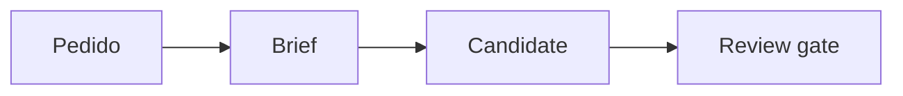

## Resultado esperado

{{EXPECTED_OUTCOME}}

## Pedido interpretado

{{INTERPRETED_REQUEST}}

## Audiencia, problema y acción

{{AUDIENCE_PROBLEM_ACTION}}

## Evidencia, fuentes y supuestos

{{EVIDENCE_SOURCES_ASSUMPTIONS}}

## Propuesta creativa

{{CREATIVE_PROPOSAL}}

## Steps y milestones

{{STEPS_AND_MILESTONES}}

## Deliverables

{{DELIVERABLES}}

## Skills y responsabilidades

{{SKILLS_AND_RESPONSIBILITIES}}

## Riesgos, límites y casos borde

{{RISKS_LIMITS_EDGE_CASES}}

## Criterios de aceptación

{{ACCEPTANCE_CRITERIA}}

## Diagrama

## Decisión y siguiente gate

{{DECISION_AND_NEXT_GATE}}
