# Chain Schematic — Multimedia P00 → P09

> Source: `MIA-MEDIA-LIB-2.0.0` v2.0.0-candidato. Flujo determinista de la cadena con gates `MW_*` inter-stage. [DOC]

## Cadena P00 → P09 (flow)

```mermaid
flowchart LR
  P00["P00 definir-sistema<br/>DEFINED"]
  P01["P01 curar-material<br/>CLASSIFIED"]
  P02["P02 investigar<br/>DISCOVERED"]
  P03["P03 crear-brief<br/>DIRECTION_APPROVED"]
  P04["P04 calendarizar<br/>DEFINED"]
  P05["P05 disenar-pieza<br/>SPEC_APPROVED"]
  P06["P06 crear-activos<br/>BUILD_VALIDATED"]
  P07["P07 revisar<br/>REVIEW_SHOTS_APPROVED"]
  P08["P08 editar<br/>POSTPRODUCTION_VALIDATED"]
  P09["P09 distribuir<br/>READY"]

  P00 --> P01 --> P02 --> P03
  P03 -. "MW_SPEC_APPROVED" .-> P04
  P04 --> P05
  P05 -. "MW_SPEC_APPROVED / G14" .-> P06
  P06 -. "MW_ASSET_REVIEW" .-> P07
  P07 --> P08
  P08 -. "MW_EDIT_APPROVED" .-> P09
  P09 -. "MW_DISTRIBUTION_AUTHORIZED" .-> CICLO["Ciclo cerrado<br/>→ P00 (aprendizaje)"]
```

## Gates inter-stage

| Gate                         | Después de | Estado work-product                | Tipo               |
| ---------------------------- | ---------- | ---------------------------------- | ------------------ |
| `MW_SPEC_APPROVED`           | P03 / P05  | DIRECTION_APPROVED / SPEC_APPROVED | manual fail-closed |
| `MW_ASSET_REVIEW`            | P06        | BUILD_VALIDATED                    | manual fail-closed |
| `MW_EDIT_APPROVED`           | P08        | POSTPRODUCTION_VALIDATED           | manual fail-closed |
| `MW_DISTRIBUTION_AUTHORIZED` | P09        | READY                              | manual fail-closed |
| `G14`                        | P05        | SPEC_APPROVED                      | calidad de marca   |

## Handoff contract

`P0N.consume ⊆ P0(N-1).produce`. El runner `_runner/run.ts` assertiona existencia del input (fail-closed handoff). La consistencia del contrato de cadena se valida en `H-E023` (chain eval).

## Quality gate (evaluada antes de avanzar estado)

`MW-Q01..MW-Q10` (`_runner/quality-gate.ts`, fail-closed). 3 coverage gaps declarados: MW-Q04 (version), MW-Q08 (evidence_tags), MW-Q10 (scope) — auto-passed con gap grabado, nunca silencioso.

## Render

Schematic HTML brand-ready por stage: ver `p0N-*/schematic.html` (generados por `_runner/render-schematic-html.ts`). Estado `RENDERED_DRAFT` — el render NO concede `HUMAN_APPROVED`, `READY` ni `PUBLISHED`.
