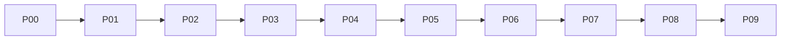

# Biblioteca Universal de Creación Multimedia

Diez workflows ejecutables. Cada etapa carga solo su prompt, templates y skills asignadas. [CONFIG]

## P00 · Define tu sistema creativo

Define perfil, Brand OS, voz o piloto, una modalidad por vez y bajo aprobación.

- Prompt: [p00-definir-sistema/prompt-spec.md](../p00-definir-sistema/prompt-spec.md)
- Estado: DEFINED
- Deliverables: brand-os-v1, calibration-sample-v1, pilot-plan-v1
- Skills: metodologia-brand-router, content-os-core, dev-writing-plans
- Gates: G13, G14

1. **S01:** Resolver identidad y autoridad de marca. · skill: `metodologia-brand-router` · gate: `G13` · stop: Bloquear si identidad, autoridad o consentimiento no son inequívocos.
2. **S02:** Definir voz, canal y audiencia sin mezclar perfiles. · skill: `content-os-core` · gate: `G13` · stop: Bloquear ante mezcla de perfiles o contexto insuficiente.
3. **S03:** Fijar tokens creativos y restricciones del piloto. · skill: `dev-writing-plans` · gate: `G14` · stop: Detener si el piloto excede alcance o carece de aprobación.

## P01 · Convierte tu día a día en oportunidades de contenido

Convierte material cotidiano en oportunidades trazables sin obligar a publicarlo.

- Prompt: [p01-curar-material/prompt-spec.md](../p01-curar-material/prompt-spec.md)
- Estado: CLASSIFIED
- Deliverables: capture-card-v1, triage-record-v1, digest-shortlist-v1
- Skills: content-os-registry, content-os-media, metodologia-find-skills
- Gates: G14

1. **S01:** Inventariar y preservar material con procedencia. · skill: `content-os-registry` · gate: `G14` · stop: Bloquear si faltan fuente, hash o autoridad.
2. **S02:** Clasificar relevancia, sensibilidad, derechos y destino. · skill: `content-os-media` · gate: `G14` · stop: Bloquear material sensible o sin derechos verificables.
3. **S03:** Seleccionar y priorizar el material utilizable. · skill: `metodologia-find-skills` · gate: `G14` · stop: Detener si ningún elemento supera el preclear de evidencia y derechos.

## P02 · Investiga y fortalece una idea

Verifica claims, encuentra matices y convierte fuentes en decisiones editoriales.

- Prompt: [p02-investigar/prompt-spec.md](../p02-investigar/prompt-spec.md)
- Estado: DISCOVERED
- Deliverables: claim-register-v1, opportunity-map-v1, question-bank-v1
- Skills: content-os-core, content-os-registry
- Gates: G14

1. **S01:** Formular preguntas verificables desde el shortlist. · skill: `content-os-core` · gate: `G14` · stop: Detener si la pregunta no puede vincularse a una decisión editorial.
2. **S02:** Buscar evidencia solo en fuentes autorizadas. · skill: `content-os-registry` · gate: `G14` · stop: Marcar UNKNOWN y bloquear si la evidencia es insuficiente.
3. **S03:** Sintetizar oportunidades, matices y límites. · skill: `content-os-core` · gate: `G14` · stop: Bloquear cualquier oportunidad basada en claims no verificados.

## P03 · Crea el brief o la campaña

Define una pieza, sistema de derivados, serie o campaña con funciones distintas.

- Prompt: [p03-crear-brief/prompt-spec.md](../p03-crear-brief/prompt-spec.md)
- Estado: DIRECTION_APPROVED
- Deliverables: brief-campaign-map-v1, ab-concepts-v1, definition-of-ready-v1
- Skills: content-os-creative, content-os-product-launch-video, content-os-core, dev-writing-plans
- Gates: G13, G14, MW_BRIEF_APPROVED

1. **S01:** Interpretar intención, audiencia, objetivo y evidencia. · skill: `content-os-creative` · gate: `G13` · stop: Formular como máximo tres preguntas; volver a P02 si falta evidencia.
2. **S02:** Elegir arquitectura de pieza, serie o campaña. · skill: `dev-writing-plans` · gate: `G13` · stop: Reducir a pieza única si la oportunidad no sostiene una campaña.
3. **S03:** Definir conceptos A/B, riesgos y criterios de éxito. · skill: `content-os-creative` · gate: `G13` · stop: Bloquear conceptos que alteren claims o excedan restricciones.
4. **S04:** Comprobar Definition of Ready y solicitar decisión. · skill: `dev-writing-plans` · gate: `MW_BRIEF_APPROVED` · stop: Detener antes de producir hasta recibir aprobación inequívoca del brief.

## P04 · Construye un calendario editorial realista

Ordena capacidad, dependencias y fechas desde investigación hasta aprendizaje.

- Prompt: [p04-calendarizar/prompt-spec.md](../p04-calendarizar/prompt-spec.md)
- Estado: DEFINED
- Deliverables: editorial-calendar-v1, board-v1, batch-plan-v1
- Skills: dev-executing-plans, content-os-core
- Gates: G14

1. **S01:** Priorizar entregables y secuencia de producción. · skill: `dev-executing-plans` · gate: `G14` · stop: Omitir P04 para una pieza única sin dependencias ni calendario.
2. **S02:** Asignar hitos, dependencias y capacidad. · skill: `dev-executing-plans` · gate: `G14` · stop: Reducir al primer sprint si la capacidad no es verificable.
3. **S03:** Definir lotes y medición antes de extender. · skill: `content-os-core` · gate: `G14` · stop: Bloquear un lote que exceda capacidad o no tenga criterio de aprendizaje.

## P05 · Diseña la pieza multimedia

Convierte un brief aprobado en guion, secuencia, continuidad y mapa de activos.

- Prompt: [p05-disenar-pieza/prompt-spec.md](../p05-disenar-pieza/prompt-spec.md)
- Estado: SPEC_APPROVED
- Deliverables: creative-spec-v1, continuity-bible-v1, asset-map-v1, universal-prompts-v1, derivatives-v1
- Skills: content-os-creative, content-os-motion-graphics, content-os-remotion-bridge, design-compose-graphics
- Gates: MW_SPEC_APPROVED, G14

1. **S01:** Elegir medio y ruta creativa desde el brief aprobado. · skill: `content-os-creative` · gate: `MW_SPEC_APPROVED` · stop: Crear un prototipo de bajo costo si el medio no puede justificarse.
2. **S02:** Diseñar narrativa, secuencia y continuidad. · skill: `content-os-motion-graphics` · gate: `MW_SPEC_APPROVED` · stop: Bloquear si la narrativa altera claims o rompe continuidad.
3. **S03:** Mapear activos, prompts y derivados. · skill: `design-compose-graphics` · gate: `G14` · stop: Bloquear cualquier activo sin fuente, owner, formato o criterio de aceptación.

## P06 · Crea los activos multimedia

Genera, guía o especifica activos por etapas, con evidencia y estado exacto.

- Prompt: [p06-crear-activos/prompt-spec.md](../p06-crear-activos/prompt-spec.md)
- Estado: BUILD_VALIDATED
- Deliverables: asset-package-v1, asset-manifest-v1, capability-report-v1, tool-run-evidence-v1
- Skills: content-os-core, content-os-remotion-create, content-os-remotion-render, content-os-media
- Gates: MW_ASSET_REVIEW, G14

1. **S01:** Ejecutar preflight de capacidad, derechos y herramientas. · skill: `content-os-core` · gate: `MW_ASSET_REVIEW` · stop: Bloquear herramienta, fuente o activo no autorizado.
2. **S02:** Producir o capturar activos por etapas. · skill: `content-os-remotion-create` · gate: `MW_ASSET_REVIEW` · stop: Limitar a prototipo no publicable si persiste riesgo o falta capacidad.
3. **S03:** Registrar procedencia y comprobar continuidad. · skill: `content-os-media` · gate: `MW_ASSET_REVIEW` · stop: Bloquear outputs sin archivo material, hash o lineage.
4. **S04:** Empaquetar el candidate sin promover su estado. · skill: `content-os-remotion-render` · gate: `G14` · stop: RENDERED_DRAFT no concede aprobación, readiness ni publicación.

## P07 · Revisa material multimedia

Diagnostica solo lo observable y transforma hallazgos en correcciones priorizadas.

- Prompt: [p07-revisar/prompt-spec.md](../p07-revisar/prompt-spec.md)
- Estado: REVIEW_SHOTS_APPROVED
- Deliverables: review-report-v1, verdict-v1, top5-changes-v1
- Skills: design-audit-genjutsu, content-os-core
- Gates: G14

1. **S01:** Revisar contenido y marca solo sobre material observable. · skill: `design-audit-genjutsu` · gate: `G14` · stop: Solicitar copia o descripción si el material no abre; nunca inventar.
2. **S02:** Verificar evidencia, derechos y accesibilidad. · skill: `content-os-core` · gate: `G14` · stop: UNKNOWN, evidencia ausente o check manual no ejecutado bloquean.
3. **S03:** Priorizar hasta cinco correcciones verificables. · skill: `design-audit-genjutsu` · gate: `G14` · stop: No remediar desde el rol verifier; emitir REVISE o BLOCKED.

## P08 · Edita, compone y reutiliza

Monta, compone, localiza y reutiliza con lineage, QC y rollback.

- Prompt: [p08-editar/prompt-spec.md](../p08-editar/prompt-spec.md)
- Estado: POSTPRODUCTION_VALIDATED
- Deliverables: edit-candidate-v1, edl-v1, export-matrix-v1
- Skills: content-os-remotion-render, remotion-video-production-v2, content-os-seam-craft
- Gates: MW_EDIT_APPROVED, G14

1. **S01:** Priorizar cambios y preparar un successor candidate. · skill: `content-os-seam-craft` · gate: `MW_EDIT_APPROVED` · stop: Preservar el candidate anterior y su lineage inmutable.
2. **S02:** Editar, componer o localizar según el EDL. · skill: `content-os-remotion-render` · gate: `MW_EDIT_APPROVED` · stop: Volver a P06 si falta un activo; no fabricar sustitutos no autorizados.
3. **S03:** Comparar, probar regresiones y definir exportación. · skill: `content-os-remotion-render` · gate: `G14` · stop: Bloquear diferencias no explicadas, QC incompleto o rollback ausente.

## P09 · Empaqueta, publica, conversa o aprende

Separa empaque, publicación, comunidad y aprendizaje para operar con control.

- Prompt: [p09-distribuir/prompt-spec.md](../p09-distribuir/prompt-spec.md)
- Estado: READY
- Deliverables: platform-package-v1, publication-record-v1, learning-report-v1
- Skills: metodologia-brand-router, instagram-content-orchestration, instagram-carousel-production
- Gates: MW_DISTRIBUTION_AUTHORIZED, G15, G17

1. **S01:** Validar autorización, estado y hash del candidate. · skill: `metodologia-brand-router` · gate: `MW_DISTRIBUTION_AUTHORIZED` · stop: Sin aprobación humana inequívoca, preparar package y detener.
2. **S02:** Adaptar el paquete al canal sin mutar el contenido aprobado. · skill: `instagram-content-orchestration` · gate: `G15` · stop: Bloquear adaptación que altere claims, marca o autorización.
3. **S03:** Preparar checklist y registro de publicación. · skill: `instagram-carousel-production` · gate: `G17` · stop: No publicar, enviar ni activar conectores desde este workflow.
4. **S04:** Registrar baseline y aprendizaje sin inventar métricas. · skill: `instagram-content-orchestration` · gate: `G17` · stop: Marcar coverage_gap si no existen datos observables.

> RENDERED_DRAFT ≠ HUMAN_APPROVED ≠ READY ≠ PUBLISHED. [CONFIG]
